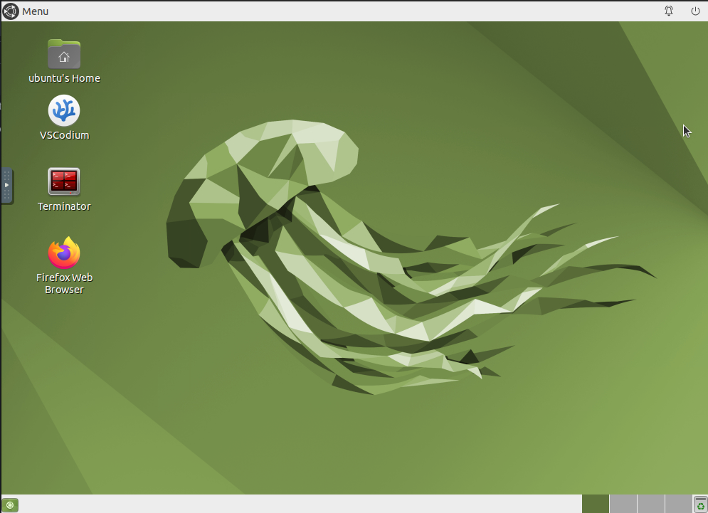
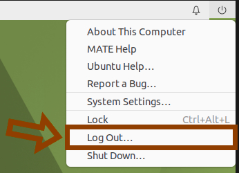

# EasyNavigation Docker Environment
This guide helps developers and researchers quickly set up and test the EasyNavigation robotics platform using Docker and ROS 2. It provides a hassle-free way to try EasyNavigation without complex local installations, supporting both Linux and non-Linux systems through containerization.

---

## Who is this for?
 - **Developers**: Quickly test and explore EasyNavigation features in a pre-configured environment.
 - **Researchers**: Evaluate the platform for your robotics projects without setup overhead.
 - **Students**: Learn robotics navigation concepts with ready-to-use tools and examples.
 - **Educators**: Use the containerized environment for teaching navigation algorithms.

---
# Installation
Choose your preferred setup method:
- **Option 1**: Local installation (Linux only, Ubuntu 24.04) - For advanced users who want direct system integration
- **Option 2**: Docker environment (Recommended) - For easy testing and cross-platform compatibility
---


## Option 1: Local installation (Linux only, Ubuntu 24.04)
If you're using Ubuntu 24.04 and prefer to install dependencies without Docker, you can install [ROS 2 Jazzy](https://docs.ros.org/en/jazzy/index.html), create a directory for the EasyNavigation environment and clone the repository and run the provided setup script to configure the simulator locally.
```sh
mkdir ~/easynav_ws && cd ~/easynav_ws
git clone https://github.com/EasyNavigation/roscon2025_workshop.git
./roscon2025_workshop/docker/installation_scripts/easynavigation_setup.sh
```

---
## Option 2: Docker environment

### A. For Windows/macOS users or Ubuntu with Docker Desktop:

#### 1. Install Docker Desktop
Install Docker Desktop from: [Docker Desktop](https://www.docker.com/products/docker-desktop/)

#### 2. Pull the Docker image
Pull the image by searching for `jmguerreroh/easynav:ubuntu24` in Docker Desktop's search interface or by running the following command in the Terminal:
```bash
docker pull jmguerreroh/easynav:ubuntu24
```

#### 3. Run the container
When running the image in Docker Desktop, set **6080** as the host port in the Docker settings. 

#### 4. Access the Virtual Desktop
Once it's running, open your browser and go to: http://localhost:6080/

You should see a full development desktop environment.

---

### B. For Ubuntu users without Docker Desktop:

#### 1. Install Docker Engine
Follow the official Docker installation guide for Ubuntu: [Docker Engine on Ubuntu](https://docs.docker.com/engine/install/ubuntu/)

#### 2. Clone the repository
Create a directory for the EasyNavigation environment and clone the repository:
```sh
mkdir ~/easynav_ws && cd ~/easynav_ws
git clone https://github.com/EasyNavigation/roscon2025_workshop.git
```

#### 3. (Optional) Install the NVIDIA Container Toolkit
To enable GPU Acceleration (Linux + NVIDIA) usage inside Docker:
- Install the [NVIDIA drivers](https://ubuntu.com/server/docs/nvidia-drivers-installation).
- Install the [NVIDIA Container Toolkit](https://docs.nvidia.com/datacenter/cloud-native/container-toolkit/latest/install-guide.html). Execute the script:

```sh
cd ~/easynav_ws/roscon2025_workshop/docker/
./nvidia_install.sh
```

- If you have an NVIDIA card in your system and it is configured with the proper drivers, you can execute the following command to switch between the integrated graphics card and the NVIDIA GPU:
```sh 
sudo prime-select nvidia
``` 

- After running prime-select, you will need to restart your system for the changes to take effect:
```sh 
sudo reboot
``` 

#### 4. Download or build the Docker image
There are two ways to get the Docker image:
- **Option 4.1: Download Prebuilt Image from Docker Hub (RECOMMENDED)**:
```sh
docker pull jmguerreroh/easynav:ubuntu24
```

- **Option 4.2: Build image locally**
Navigate to the Docker directory and build the Docker image:
```sh
cd ~/easynav_ws/roscon2025_workshop/docker/
sudo docker buildx build --platform=linux/amd64  -t jmguerreroh/easynav:ubuntu24 -f Dockerfile .
```

#### 5. Run Docker image
Run the Docker image using the provided script:
```sh
cd ~/easynav_ws/roscon2025_workshop/docker/
./run_docker.sh
```

**Note:** If you run this command without having the image, it will attempt to download it from Docker Hub as in step 4.1.

#### 6. Access the Virtual Desktop
Open your browser and go to: http://localhost:6080/

You should see a full development desktop environment:



---

## Managing the Docker Container

### Stopping the container
If the container is currently running and you need to stop it, follow these steps:

1. First, log out of the Docker container environment in your browser:
   

2. Then, stop the Docker container using the following command:
```sh
docker stop easynav
```

**Note:** Your work is preserved unless you explicitly remove the container.

### Restarting the container
If the container is stopped and you want to start it again:
```sh
docker start easynav
```

Then access it again at: http://localhost:6080/

---
## Customization and Advanced Usage

### Custom Environment Setup
If you need to customize the environment with additional packages or configurations:
1. Create your own installation script and place it inside the `docker/installation_scripts/` folder.
2. Follow steps 4.2 and 5 from Option 2B to build a custom Docker image.
3. Execute your script inside the Docker container. Once running, open a terminal and execute:

```sh
source /installation_scripts/your_script.sh
```

### Using Pre-built Custom Images
If you have access to a custom EasyNavigation image:
1. Pull the specific image version you need:
```sh
docker pull your-custom-image:tag
```
2. Modify the `run_docker.sh` script to use your custom image name.
3. Follow the same steps as above to run the container.
4. Any custom scripts can be downloaded directly in the browser environment and executed in the terminal.


Para ejemplos de Nav2 y ejercicios del workshop, ver: [nav2_playground](../easynav_playground_kobuki/README.md)