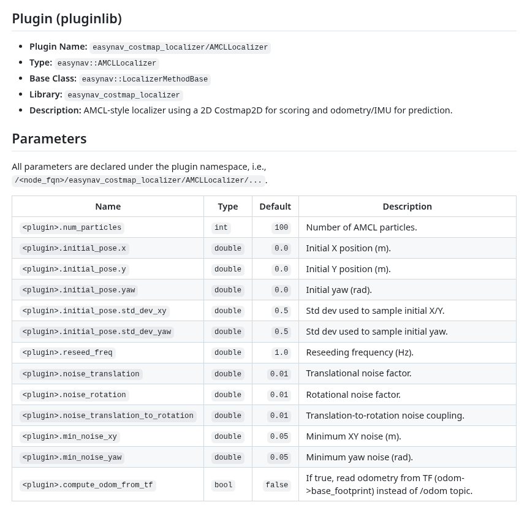
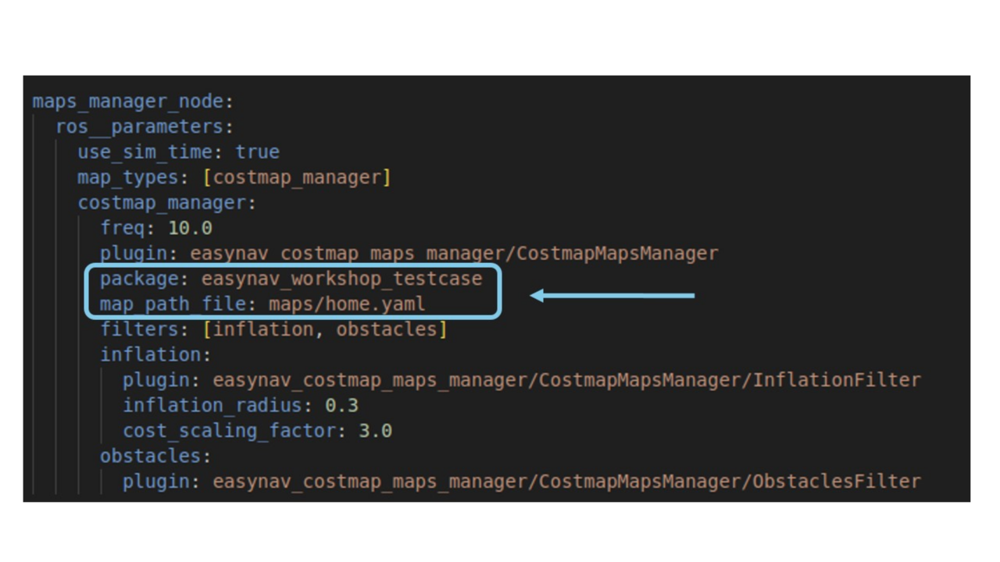
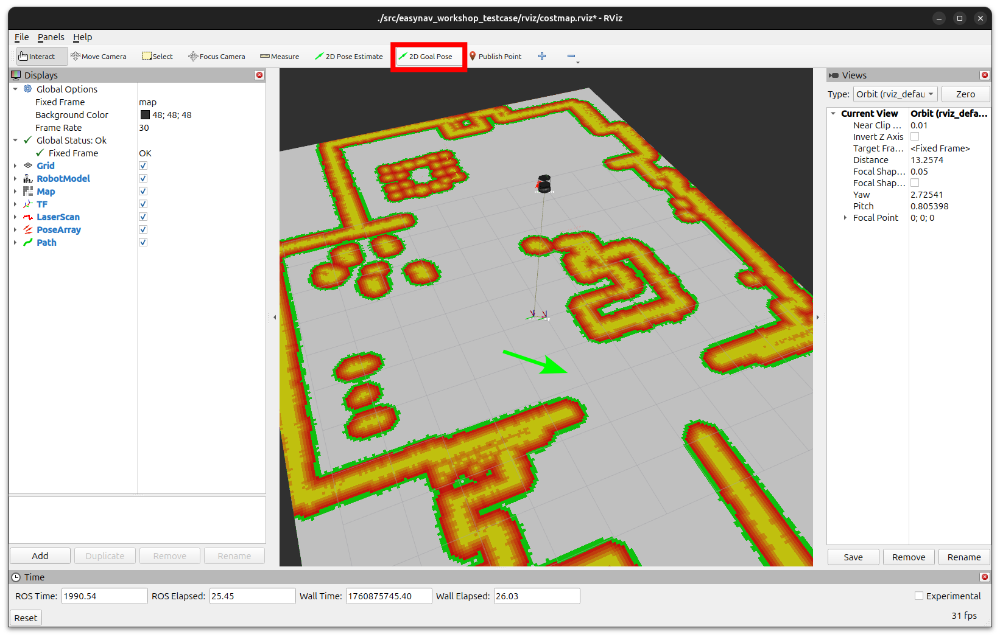
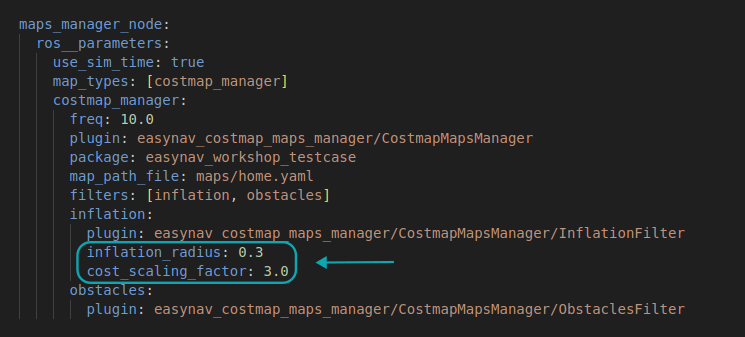
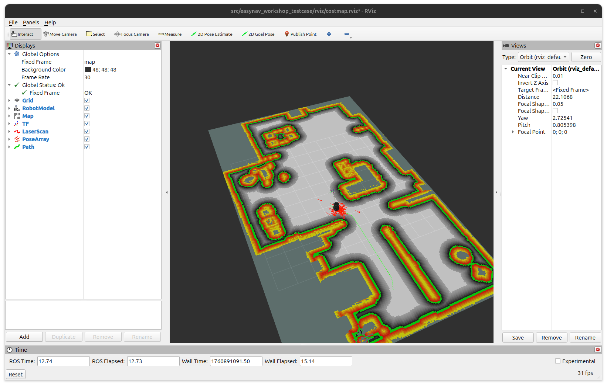

# Exercise 1: Launching EasyNav with a Basic Configuration

EasyNav simplifies navigation by using a single main node to coordinate five subnodes, eliminating the need for complex, interwoven launch files.

In this exercise, we will use plugins compatible with costmap representation. It is crucial to ensure that the selected plugins are **compatible with each other**. You can explore these plugins in the [EasyNav plugin documentation](https://easynavigation.github.io/plugins/index.html).

## Plugin Configuration

For each plugin, you need to define:
- **Simulation time:** Enable `use_sim_time` to synchronize the simulation with EasyNav execution.
- **<Plugin_base> type:** Assign an alias to the specific plugin for use in the configuration under `<plugin base>_types`.
- **Plugin-specific parameters:** Define parameters such as `rt_freq` and `freq` to ensure synchronized execution. Detailed parameter information for each plugin can be found in its respective README. For instance, the `easynav_costmap_localizer/AMCLLocalizer` plugin can be configured with the following parameters:



### Example Configuration

Below is an example configuration for the `localizer_node`:

```yaml
localizer_node:
  ros__parameters:
    use_sim_time: true
    localizer_types: [costmap_localizer]
    costmap_localizer:
      rt_freq: 50.0
      freq: 5.0
      reseed_freq: 1.0
      plugin: easynav_costmap_localizer/AMCLLocalizer
      num_particles: 100
      noise_translation: 0.05
      noise_rotation: 0.1
      noise_translation_to_rotation: 0.1
      initial_pose:
        x: 0.0
        y: 0.0
        yaw: 0.0
        std_dev_xy: 0.1
        std_dev_yaw: 0.01
```

Refer to the `costmap_basic.params.yaml` file in this folder for the full configuration. You can also navigate to the plugin pages for more details:
- **Planner:** `easynav_costmap_planner/CostmapPlanner` — [README](https://github.com/EasyNavigation/easynav_plugins/blob/jazzy/planners/easynav_costmap_planner/README.md)
- **Maps Manager:** `easynav_costmap_maps_manager/CostmapMapsManager` — [README](https://github.com/EasyNavigation/easynav_plugins/tree/jazzy/maps_managers/easynav_costmap_maps_manager/README.md)
- **Localizer:** `easynav_costmap_localizer/AMCLLocalizer` — [README](https://github.com/EasyNavigation/easynav_plugins/blob/jazzy/localizers/easynav_costmap_localizer/README.md)
- **Controller:** For this exercise, use `easynav_serest_controller/SerestController` — [README](https://github.com/EasyNavigation/easynav_plugins/tree/jazzy/controllers/easynav_serest_controller/README.md)

### Sensor Configuration

The `sensors_node` specifies the sensors used, their topics, frames, and types. Currently, EasyNav supports LaserScan, PointCloud, and Image types. Below is an example configuration:

```yaml
sensors_node:
  ros__parameters:
    use_sim_time: true
    forget_time: 0.5
    sensors: [laser1]
    perception_default_frame: odom
    laser1:
      topic: scan_raw
      type: sensor_msgs/msg/LaserScan
```

### System Node Configuration

The `system_node` defines global parameters such as tolerances for the final pose and orientation:

```yaml
system_node:
  ros__parameters:
    use_sim_time: true
    position_tolerance: 0.3
    angle_tolerance: 0.15
```

## Map setup

Before we begin a simple navigation task, let’s use the map we created earlier in the first part of the talk.

1. Copy your map files (`<map>.pgm` and `<map>.yaml`) into the playground package `maps/` directory. Example:
```bash
# Example: move both the .pgm and .yaml into the nav2_playground maps folder
mv /path/to/map/<map_name>.* <your-workspace>/src/nav2_playground/maps/
```

2. Rebuild the playground package to include the maps in the installed data:
```bash
colcon build --packages-select nav2_playground
```

Once the map files are in your workspace, point the workshop config to the package and map path (see `costmap_workshop.params.yaml` in this exercise folder). If you don't have a custom map, you can use the provided `home` map available in `roscon2025_workshop/easynav_workshop/easynav_workshop_testcase/maps/`.


### Where to set the map in the params file

Edit `costmap_workshop.params.yaml` and set the maps manager package and map file. 



Use the package name that contains the `maps/` folder you copied the files into.

## Execution

Source your workspace and launch the playground and EasyNav:

```bash
cd <your-workspace>
source install/setup.bash
```

2. Launch the Kobuki playground:
```bash
ros2 launch easynav_playground_kobuki playground_kobuki.launch.py
```

3. Start EasyNav with the workshop params (in a separate terminal):
```bash
ros2 run easynav_system system_main --ros-args --params-file src/roscon2025_workshop/easynav_workshop/easynav_workshop_testcase/exercises/1.basic_config/costmap_workshop.params.yaml 
```

4. Start RViz (use simulation time):
```bash
ros2 run rviz2 rviz2 -d src/roscon2025_workshop/easynav_workshop/easynav_workshop_testcase/rviz/costmap.rviz --ros-args -p use_sim_time:=true
```

In RViz, use the "2D Nav Goal" tool (toolbar button) to set a goal: click to place the position and drag to set the yaw. The planner will generate a path and the controller should start moving the robot towards the goal.




### Expected behavior

After publishing a 2D Nav Goal in RViz you should see:
- A planned path appear in RViz (the planner's path topic).
- The controller publishing velocity commands (`cmd_vel`) to move the robot along the path.
- The robot following the path and stopping within the configured `position_tolerance` and `angle_tolerance`.

## Change a parameter

Similar to the previous exercise in **Nav2**, we can adjust parameters such as the **inflation radius** or **cost scaling factor** in the map manager simply by modifying their values in the configuration file.



Let's increase the `inflation_radius` parameter and observe how the obstacles become more inflated, resulting in the robot maintaining a greater safety distance from them.



## Troubleshooting

- Config file not found by the system: double-check the path you passed to `--params-file`. Use an absolute path or a workspace-relative path (example above).
- Map not loaded / wrong map: confirm the `.pgm` and `.yaml` pair are in the package `maps/` directory and that the YAML references the correct PGM filename.
- Build issues after adding maps: re-run `colcon build --packages-select <playground_package>` and then `source install/setup.bash`.
- Real-time permissions: if you see errors about real-time priority, add the following lines to `/etc/security/limits.conf` (replace `<username>` with your user), then **reboot**:

```text
<username> - memlock unlimited
<username> - rtprio 98
```
