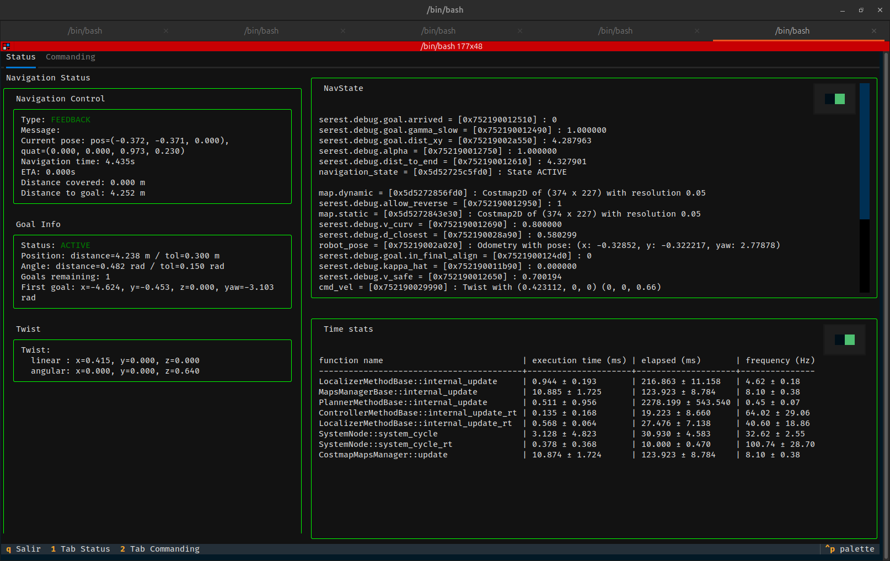
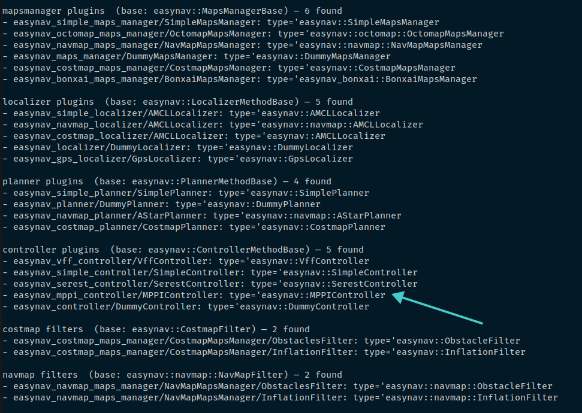

# Exercise 2: Using EasyNav tools

EasyNav includes a Terminal User Interface (TUI) and a small CLI that help monitor and inspect the running navigation system without a GUI. This exercise shows how to use them to monitor state, inspect topics, and list available plugins.

## Terminal User Interface (TUI)

The TUI displays key diagnostic information and performance metrics directly in the terminal. It is useful for debugging and profiling when you don't want to use RViz. Start it while the system is running:

```bash
ros2 run easynav_tools tui
```

The TUI has five main panels:
- **Navigation Control**: current navigation mode (FEEDBACK, ACTIVE), robot pose, progress and remaining distance.
- **Goal Info**: active goal details, tolerances and goal list.
- **Twist**: live linear and angular velocity commands published by the controller.
- **NavState**: internal blackboard entries (robot_pose, cmd_vel, active map, navigation_state).
- **Time stats**: execution time and update frequency per component (localizer, planner, controller, maps manager, etc.).

Use the TUI while issuing a goal in RViz to watch how the system's state evolves in real time.



## Command-Line Interface (CLI)

If you only need one specific view, the CLI exposes individual boards as commands. Run the CLI and specify the board you want:

```bash
ros2 easynav <board>
# where <board> is one of: goal_info | nav_state | twist | navigation_control | timestat
```

Example: show the current goal info
```bash
ros2 easynav goal_info
```

The CLI can also list available plugins for your current configuration:

```bash
ros2 easynav plugins
```

## Exercise

From the list of available plugins, choose one (for example, the `mppi` controller). The MPPI controller is independent of the map representation and is a good candidate for testing.

Consult the MPPI README for full parameter details:
https://github.com/EasyNavigation/easynav_plugins/blob/rolling/controllers/easynav_mppi_controller/README.md

Example: set controller parameters
- `rt_freq`: 30.0 (controller loop frequency)
- `max_linear_velocity`: 0.8 (m/s)
- `max_angular_velocity`: 0.5 (rad/s)
- `safety_radius`: 0.7 (m)

Resulting params (update your params file accordingly):

```yaml
controller_node:
  ros__parameters:
    use_sim_time: true
    controller_types: [mppi]
    mppi:
      rt_freq: 30.0
      plugin: easynav_mppi_controller/MPPIController
      max_linear_velocity: 0.8
      max_angular_velocity: 0.5
      safety_radius: 0.7
```

Use the TUI or the CLI to monitor how the chosen controller behaves after you publish a goal in RViz. For example, if `max_linear_velocity` is 0.8, `cmd_vel` linear components should not exceed this value (allowing for small transient spikes depending on controller internals).


