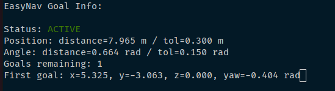

# Exercise 3: Patrolling behavior

The patrolling behavior is a simple example of commanding navigation goals programmatically. It allows a robot to automatically navigate through a series of predefined waypoints on a map. These waypoints are defined in a YAML configuration file. It relies on the Goal Manager Client available both for C++ ([GoalManagerClient.cpp](https://github.com/EasyNavigation/EasyNavigation/blob/jazzy/easynav_system/src/easynav_system/GoalManagerClient.cpp)) and Python ([goal_manager_client.py](https://github.com/EasyNavigation/EasyNavigation/blob/jazzy/easynav_support_py/easynav_goalmanager_py/goal_manager_client.py)).

Both the C++ and Python implementations use the same GoalManager interface, so their runtime behavior is identical, allowing us to send navigation goals and monitor the navigation state. It can be extended to perform inspection, delivery, or monitoring tasks. The node operates with a finite state machine with 5 states:

```text
┌─────────────┐
│   START     │
└──────┬──────┘
       │
       ▼
┌─────────────┐    Initialize?
│    IDLE     │────────────────► Load waypoints
└──────┬──────┘                  Create client
       │ Send current waypoint
       ▼
┌─────────────┐
│ PATROLLING  │◄─────┐
└──────┬──────┘      │
       │ Navigation  │
       │ finished?   │
       ▼             │
┌──────────────────┐ │
│ DO_AT_WAYPOINT   │ │
└──────┬───────────┘ │
       │             │
       │ task done   │
       ├─────────────┘
       │ More waypoints?
       ▼
┌─────────────┐
│  FINISHED   │
└──────┬──────┘
       │ Reset & loop
       └────► IDLE
```


# Exercise: Patrolling Task

The goal of this exercise is to program a robot to traverse a list of waypoints and perform specific actions upon reaching each waypoint.

## Waypoints

As an example, a predefined list of four waypoints is available at: `<your-ws-path>/src/roscon2025_workshop/easynav_workshop/easynav_patrolling_behavior/config/patrolling_params.yaml`


### Generating Custom Waypoints

To create your own waypoints, specify the goal pose positions (`x`, `y` in meters) and orientation (`yaw` in radians). A simple way to extract these points from the simulation is by publishing them as goals in RViz (as demonstrated in Exercise 1) and using the EasyNav CLI to retrieve the coordinates. To do this, execute the following command:
```bash
ros2 easynav goal_info
```
This will display the goal values, which you can then save into a configuration file for traversing multiple points programmatically.



Save these values into a configuration file to define the waypoints for your patrolling task.


## Do something at waypoint

You also need to modify the code to perform specific actions at each waypoint. Examples of such actions include:

- Adding a wait time to simulate task execution.
- Logging data, spinning the robot in place, or other custom behaviors.

You also need to configure the following aspects:
- After completing the actions at a waypoint, transition the robot back to the `IDLE` state.
- If all waypoints have been visited, transition to the `FINISHED` state.
- Ensure the `current_goal_index_` is incremented appropriately after each waypoint.

You can implement this behavior in either C++ or Python, depending on your preference.

### Cpp Version

To implement the patrolling behavior, edit the file located at: `<your-ws-path>/src/roscon2025_workshop/easynav_workshop/easynav_patrolling_behavior/src/easynav_patrolling_behavior/PatrollingNode.cpp`. 

Depending on your solution, you may need to modify the following:
- The `DO_AT_WAYPOINT` state to define actions performed at each waypoint.
- The state transitions to ensure proper navigation flow.
- The header file to declare any additional parameters or methods required.

#### Testing Your Implementation

Once the behavior is implemented and the waypoints are selected, you can test your solution with the following steps:

1. Build the package:
   ```bash
   colcon build --packages-select easynav_patrolling_behavior
    ```
2. Source the setup file:
   ```bash
    source install/setup.bash
    ```
3. Launch the Kobuki playground:
```bash
ros2 launch easynav_playground_kobuki playground_kobuki.launch.py
```

4. Start RViz (use simulation time):
```bash
ros2 run rviz2 rviz2 -d src/roscon2025_workshop/easynav_workshop/easynav_workshop_testcase/rviz/costmap.rviz --ros-args -p use_sim_time:=true
```

5. Start EasyNav with the workshop params:
```bash
ros2 run easynav_system system_main --ros-args --params-file src/roscon2025_workshop/easynav_workshop/easynav_workshop_testcase/exercises/1.basic_config/costmap_workshop.params.yaml 
```
6. Run the patrolling node with the specified parameters:
    ```bash
    ros2 run easynav_patrolling_behavior patrolling_main --ros-args --params-file src/roscon2025_workshop/easynav_workshop/easynav_patrolling_behavior/config/patrolling_params.yaml
    ```
    
### Python version
To implement the patrolling behavior, edit the file located at: `<your-ws-path>/src/roscon2025_workshop/easynav_workshop/easynav_patrolling_behavior_py/easynav_patrolling_behavior_py/patrolling_node.py`. 

Depending on your solution, you may need to modify the following:
- The `DO_AT_WAYPOINT` state to define actions performed at each waypoint.
- The state transitions to ensure proper navigation flow.
- The header file to declare any additional parameters or methods required.

#### Testing Your Implementation

Once the behavior is implemented and the waypoints are selected, you can test your solution with the following steps:

1. Build the package:
   ```bash
   colcon build --packages-select easynav_patrolling_behavior_py
    ```
2. Source the setup file:
   ```bash
    source install/setup.bash
    ```
3. Launch the Kobuki playground:
```bash
ros2 launch easynav_playground_kobuki playground_kobuki.launch.py
```

4. Start RViz (use simulation time):
```bash
ros2 run rviz2 rviz2 -d src/roscon2025_workshop/easynav_workshop/easynav_workshop_testcase/rviz/costmap.rviz --ros-args -p use_sim_time:=true
```

5. Start EasyNav with the workshop params:
```bash
ros2 run easynav_system system_main --ros-args --params-file src/roscon2025_workshop/easynav_workshop/easynav_workshop_testcase/exercises/1.basic_config/costmap_workshop.params.yaml 
```
6. Run the patrolling launcher using the desired parameters:
    ```bash
    ros2 launch easynav_patrolling_behavior_py patrolling.launch.py 
    ```

## Solutions
In the solution folder in this exercise folder you have some proposed solutions for both versions.