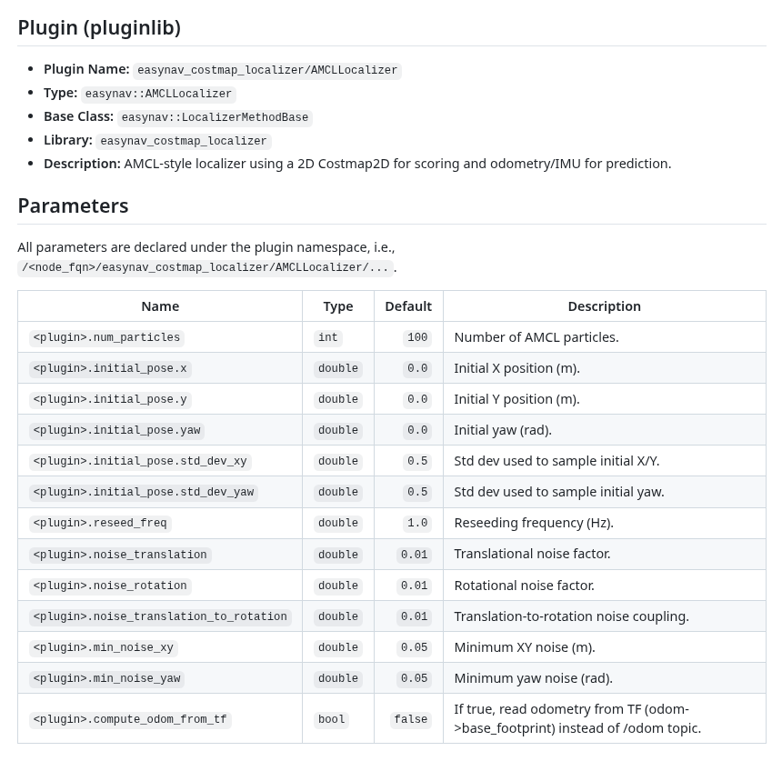
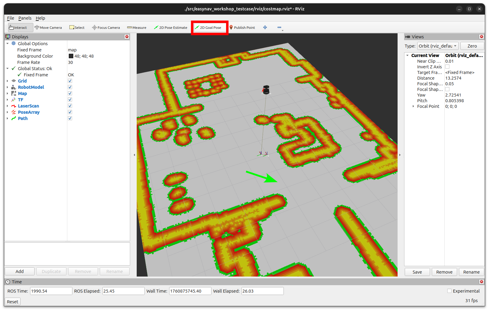
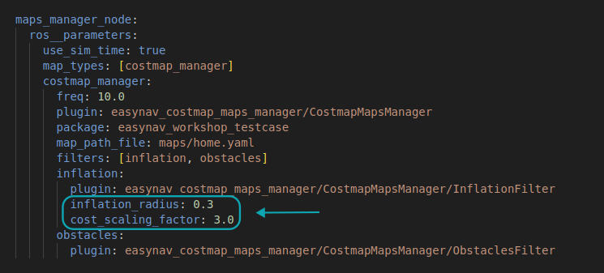
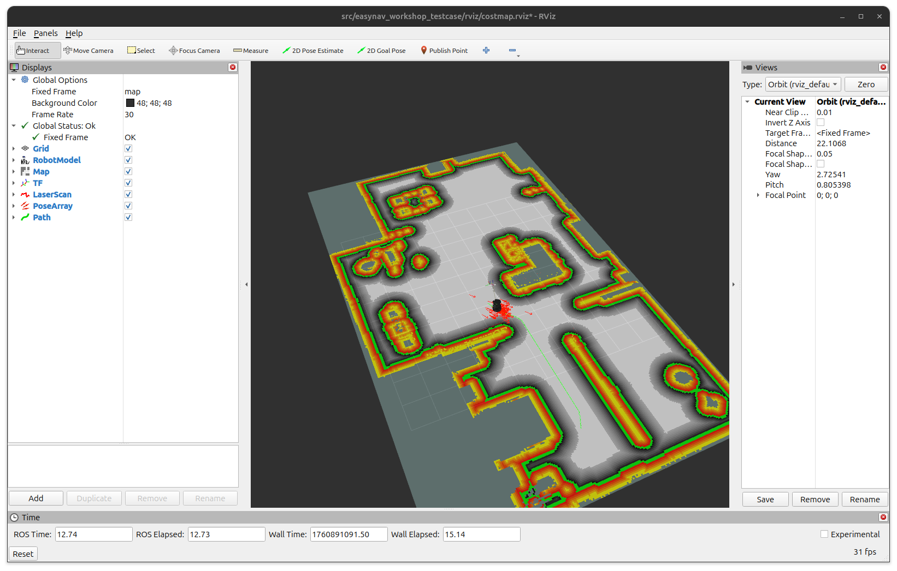
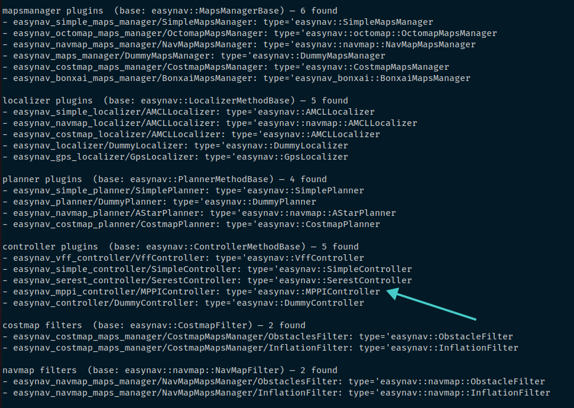

# Exercise 1: Launching EasyNav with a Basic Configuration

EasyNav simplifies navigation by using a single main node to coordinate five subnodes, eliminating the need for complex, interwoven launch files.

In this exercise, we will use plugins compatible with costmap representation. It is crucial to ensure that the selected plugins are **compatible with each other**. You can explore these plugins in the [EasyNav plugin documentation](https://easynavigation.github.io/plugins/index.html).

## Plugin Configuration

For each plugin, you need to define:
- **Simulation time:** Enable `use_sim_time` to synchronize the simulation with EasyNav execution.
- **<Plugin_base> type:** Assign an alias to the specific plugin for use in the configuration under `<plugin base>_types`.
- **Plugin-specific parameters:** Define parameters such as `rt_freq` and `freq` to ensure synchronized execution. Detailed parameter information for each plugin can be found in its respective README. For instance, the `easynav_costmap_localizer/AMCLLocalizer` plugin can be configured with the following parameters:



### Example Configuration

Below is an example configuration for the `localizer_node`:

```yaml
localizer_node:
  ros__parameters:
    use_sim_time: true
    localizer_types: [costmap_localizer]
    costmap_localizer:
      rt_freq: 50.0
      freq: 5.0
      reseed_freq: 1.0
      plugin: easynav_costmap_localizer/AMCLLocalizer
      num_particles: 100
      noise_translation: 0.05
      noise_rotation: 0.1
      noise_translation_to_rotation: 0.1
      initial_pose:
        x: 0.0
        y: 0.0
        yaw: 0.0
        std_dev_xy: 0.1
        std_dev_yaw: 0.01
```

Refer to the `costmap_basic.params.yaml` file in this folder for the full configuration. You can also navigate to the plugin pages for more details:
- **Planner:** `easynav_costmap_planner/CostmapPlanner` — [README](https://github.com/EasyNavigation/easynav_plugins/blob/jazzy/planners/easynav_costmap_planner/README.md)
- **Maps Manager:** `easynav_costmap_maps_manager/CostmapMapsManager` — [README](https://github.com/EasyNavigation/easynav_plugins/tree/jazzy/maps_managers/easynav_costmap_maps_manager/README.md)
- **Localizer:** `easynav_costmap_localizer/AMCLLocalizer` — [README](https://github.com/EasyNavigation/easynav_plugins/blob/jazzy/localizers/easynav_costmap_localizer/README.md)
- **Controller:** For this exercise, use `easynav_serest_controller/SerestController` — [README](https://github.com/EasyNavigation/easynav_plugins/tree/jazzy/controllers/easynav_serest_controller/README.md)

### Sensor Configuration

The `sensors_node` specifies the sensors used, their topics, frames, and types. Currently, EasyNav supports LaserScan, PointCloud, and Image types. Below is an example configuration:

```yaml
sensors_node:
  ros__parameters:
    use_sim_time: true
    forget_time: 0.5
    sensors: [laser1]
    perception_default_frame: odom
    laser1:
      topic: scan_raw
      type: sensor_msgs/msg/LaserScan
```

### System Node Configuration

The `system_node` defines global parameters such as tolerances for the final pose and orientation:

```yaml
system_node:
  ros__parameters:
    use_sim_time: true
    position_tolerance: 0.3
    angle_tolerance: 0.15
```

## Map setup

Before we begin a simple navigation task, let’s use the map we created earlier in the first part of the talk. Point the workshop config to the package and map path (see `costmap_workshop.params.yaml` in this exercise folder). If you don't have a custom map, you can use the provided `home` map available in `easynav_workshop_testcase/maps/`.


### Where to set the map in the params file

Edit `costmap_workshop.params.yaml` and set the maps manager package and map file. 


Use the package name that contains the `maps/` folder you copied the files into.

## Execution


1. Launch the Kobuki playground:
```bash
ros2 launch easynav_playground_kobuki playground_kobuki.launch.py
```

2. Start EasyNav with the workshop params (in a separate terminal):
```bash
ros2 run easynav_system system_main --ros-args --params-file ~/workshop_ws/src/exercises/easynav/easynav_playground/easynav_workshop_testcase/config/costmap_workshop.params.yaml
```

4. Start RViz (use simulation time):
```bash
ros2 run rviz2 rviz2 -d ~/workshop_ws/src/exercises/easynav/easynav_playground/easynav_workshop_testcase/rviz/costmap.rviz 
```

In RViz, use the "2D Nav Goal" tool (toolbar button) to set a goal: click to place the position and drag to set the yaw. The planner will generate a path and the controller should start moving the robot towards the goal.




### Expected behavior

After publishing a 2D Nav Goal in RViz you should see:
- A planned path appear in RViz (the planner's path topic).
- The controller publishing velocity commands (`cmd_vel`) to move the robot along the path.
- The robot following the path and stopping within the configured `position_tolerance` and `angle_tolerance`.

## Change a parameter

Similar to the previous exercise in **Nav2**, we can adjust parameters such as the **inflation radius** or **cost scaling factor** in the map manager simply by modifying their values in the configuration file.



Let's increase the `inflation_radius` parameter and observe how the obstacles become more inflated, resulting in the robot maintaining a greater safety distance from them.



## EasyNav tools

EasyNav includes a Terminal User Interface (TUI) and a small CLI that help monitor and inspect the running navigation system without a GUI. This exercise shows how to use them to monitor state, inspect topics, and list available plugins.

### Terminal User Interface (TUI)

The TUI displays key diagnostic information and performance metrics directly in the terminal. It is useful for debugging and profiling when you don't want to use RViz. Start it while the system is running:

```bash
ros2 run easynav_tools tui
```

The TUI has five main panels:
- **Navigation Control**: current navigation mode (FEEDBACK, ACTIVE), robot pose, progress and remaining distance.
- **Goal Info**: active goal details, tolerances and goal list.
- **Twist**: live linear and angular velocity commands published by the controller.
- **NavState**: internal blackboard entries (robot_pose, cmd_vel, active map, navigation_state).
- **Time stats**: execution time and update frequency per component (localizer, planner, controller, maps manager, etc.).

Use the TUI while issuing a goal in RViz to watch how the system's state evolves in real time.


### Command-Line Interface (CLI)

If you only need one specific view, the CLI exposes individual boards as commands. Run the CLI and specify the board you want:

```bash
ros2 easynav <board>
# where <board> is one of: goal_info | nav_state | twist | navigation_control | timestat
```

Example: show the current goal info
```bash
ros2 easynav goal_info
```

The CLI can also list available plugins for your current configuration:

```bash
ros2 easynav plugins
```


## Troubleshooting

- Config file not found by the system: double-check the path you passed to `--params-file`. Use an absolute path or a workspace-relative path (example above).
- Map not loaded / wrong map: confirm the `.pgm` and `.yaml` pair are in the package `maps/` directory and that the YAML references the correct PGM filename.

- Real-time permissions: if you want to use real-time priority, add the following lines to `/etc/security/limits.conf` (replace `<username>` with your user), then **reboot**:

```text
<username> - rtprio 98
```
