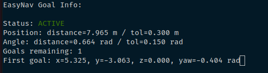

# Exercise 3: Patrolling behavior in GridMap

The patrolling behavior is a simple example of commanding navigation goals programmatically. It allows a robot to automatically navigate through a series of predefined waypoints on a map. These waypoints are defined in a YAML configuration file. It relies on the Goal Manager Client available both for C++ ([GoalManagerClient.cpp](https://github.com/EasyNavigation/EasyNavigation/blob/jazzy/easynav_system/src/easynav_system/GoalManagerClient.cpp)) and Python ([goal_manager_client.py](https://github.com/EasyNavigation/EasyNavigation/blob/jazzy/easynav_support_py/easynav_goalmanager_py/goal_manager_client.py)).

Both implementations share the same GoalManager interface, so their runtime behavior is identical. This allows developers to send navigation goals and monitor the navigation state consistently across languages.

In this example, the `PatrollingNode` is responsible for navigating a robot through a set of waypoints using the Goal Manager Client. The system is designed to:
- Send navigation goals to the robot autonomously.
- Handle goal acceptance, rejection, or failure.
- Pause at waypoints for a configurable duration.


This behavior can be extended for practical applications such as inspection, delivery, or monitoring tasks.

The node operates using a finite state machine (FSM) with five states:

```text
┌─────────────┐
│   START     │
└──────┬──────┘
       │
       ▼
┌─────────────┐    Initialize?
│    IDLE     │────────────────► Load waypoints
└──────┬──────┘                  Create client
       │ Send current waypoint
       ▼
┌─────────────┐
│ PATROLLING  │◄─────┐
└──────┬──────┘      │
       │ Navigation  │
       │ finished?   │
       ▼             │
┌──────────────────┐ │
│ DO_AT_WAYPOINT   │ │
└──────┬───────────┘ │
       │             │
       │ task done   │
       ├─────────────┘
       │ More waypoints?
       ▼
┌─────────────┐
│  FINISHED   │
└──────┬──────┘
       │ Reset & loop
       └────► IDLE
```

## The PatrollingNode

The PatrollingNode is a ROS 2 node with a timer calling the main loop `cycle()` every 100ms:

```cpp
PatrollingNode::PatrollingNode(const rclcpp::NodeOptions & options)
: Node("patrolling_node", options)
{
  timer_ = create_timer(
        100ms,
        std::bind(&PatrollingNode::cycle, this));
}
```

We also have an initialize function which loads a set of waypoints and stores them in a goals message.

```cpp
void PatrollingNode::initialize()
{
  std::vector<std::string> waypoints;
  declare_parameter("waypoints", waypoints);
  get_parameter("waypoints", waypoints);

  declare_parameter<std::string>("frame_id", "map");
  get_parameter("frame_id", frame_id_);

  goals_.header.frame_id = frame_id_;
  ...
}
```

The PatrollingNode uses a finite state machine (FSM) to manage the patrolling behavior. The FSM is first initialized when the system enters the IDLE state. During this initialization:

- A `GoalManagerClient` pointer is created to interface with the navigation system.
- More details about the `GoalManagerClient` can be found in the [Doxygen documentation](https://easynavigation.github.io/EasyNavigation/classeasynav_1_1GoalManagerClient.html).

The IDLE state is also responsible for sending one navigation goal at a time.

```cpp
case PatrolState::IDLE:
{
    if (!initialized_) {
        RCLCPP_INFO(get_logger(), "Initializing patrolling");
        gm_client_ = GoalManagerClient::make_shared(shared_from_this());
        initialize();
        initialized_ = true;
    }

    nav_msgs::msg::Goals single_goal;
    single_goal.header = goals_.header;
    single_goal.goals.push_back(goals_.goals[current_goal_index_]);
    gm_client_->send_goals(single_goal);

    RCLCPP_INFO(get_logger(), "Goals sent");
    state_ = PatrolState::PATROLLING;
}
break;
```
The main loop is implemented in the `cycle()` function and handles the FSM logic. The node has five states:

```cpp
switch (state_) {
    case PatrolState::IDLE: ...
    case PatrolState::PATROLLING: ...
    case PatrolState::: ...
    case PatrolState::FINISHED: ...
    case PatrolState::ERROR: ...
} 
```
On each iteration, the navigation state is queried from the Goal Manager Client:
```cpp
auto nav_state = gm_client_->get_state();
```
This results in two FSMs running simultaneously:

- Goal Manager Client FSM which handles low-level navigation and goal management and its state is stored in the `nav_state`.
- Patrolling FSM which handles higher-level task logic, including other actions such as inspection, pick-and-place, etc. The current patrolling state is stored in `state_`.

In this exercise, we simulate an inspection task using the DO_AT_WAYPOINT state. This state is entered after the Goal Manager Client completes navigation to the current waypoint. It pauses the robot at the waypoint for 3 seconds to simulate the inspection. After the pause, the system either advances to the next goal in the list or transitions to the FINISHED state if the current waypoint was the last one.

```cpp
case GoalManagerClient::State::NAVIGATION_FINISHED:
    RCLCPP_INFO(get_logger(), "Navigation successfully finished with message %s",
                gm_client_->get_result().status_message.c_str());

    state_ = PatrolState::DO_AT_WAYPOINT;
    break;

case PatrolState::DO_AT_WAYPOINT:
    if (now() - pause_start_time_ >= pause_duration_) {
        RCLCPP_INFO(get_logger(), "Waiting time ended at waypoint %zu", current_goal_index_ + 1);

        ++current_goal_index_;
        if (current_goal_index_ < goals_.goals.size()) {
            RCLCPP_INFO(get_logger(), "Navigating to waypoint %zu", current_goal_index_ + 1);
            gm_client_->reset();
            state_ = PatrolState::IDLE;
        } else {
            RCLCPP_INFO(get_logger(), "All waypoints completed");
            state_ = PatrolState::FINISHED;
        }
    }
    break;
```
## Configuring our environment

Before proceeding with our patrolling task, we will explore another representation supported in EasyNav: GridMap. For this example, we will use an outdoor simulation with a Summit XL robot.

To use GridMap, we need to select the correct combination of plugins. Specifically, we require a localizer, planner, and maps manager that are compatible with GridMap.


For the localizer, we use a plugin based on the 3D LidarSLAM implementation for ROS 2 by _rsasaki0109_. This requires configuring the topic and update frequencies. Since we have updated the simulation, we also need to update the sensor topic in the sensors node to match the new setup.

```yaml
localizer_node:
  ros__parameters:
    use_sim_time: true
    localizer_types: [lidarslam]
    lidarslam:
      freq: 5.0
      rt_freq: 20.0
      plugin: easynav_lidarslam_localizer/LidarSlamLocalizer
      input_cloud: /front_laser/points

sensors_node:
  ros__parameters:
    use_sim_time: true
    forget_time: 0.5
    sensors: [laser1]
    perception_default_frame: odom
    laser1:
      topic: /front_laser/points
      type: sensor_msgs/msg/PointCloud2
      group: points
```
We also need to specify the LidarSLAM parameters used internally by the localizer.
```yaml
scan_matcher:
  ros__parameters:
    use_sim_time: True
    global_frame_id: "map"
    robot_frame_id: "base_link"
    odom_frame_id: "odom"
    registration_method: "NDT"
    ndt_resolution: 2.0
    ndt_num_threads: 2
    gicp_corr_dist_threshold: 5.0
    trans_for_mapupdate: 1.5
    vg_size_for_input: 0.5
    vg_size_for_map: 0.2
    use_min_max_filter: true
    scan_min_range: 1.0
    scan_max_range: 200.0
    scan_period: 0.2
    map_publish_period: 15.0
    num_targeted_cloud: 20
    set_initial_pose: true
    initial_pose_x: 0.0
    initial_pose_y: 0.0
    initial_pose_z: 0.0
    initial_pose_qx: 0.0
    initial_pose_qy: 0.0
    initial_pose_qz: 0.0
    initial_pose_qw: 1.0
    use_imu: false
    use_odom: true
    debug_flag: false

graph_based_slam:
  ros__parameters:
    use_sim_time: True
    registration_method: "NDT"
    ndt_resolution: 1.0
    ndt_num_threads: 2
    voxel_leaf_size: 0.2
    loop_detection_period: 3000
    threshold_loop_closure_score: 0.7
    distance_loop_closure: 100.0
    range_of_searching_loop_closure: 20.0
    search_submap_num: 2
    num_adjacent_pose_cnstraints: 5
    use_save_map_in_loop: true
    debug_flag: true
```
We also need to configure the Maps Manager for GridMap with the corresponding map:

```yaml
maps_manager_node:
  ros__parameters:
    use_sim_time: true
    map_types: [gridmap]
    gridmap:
      freq: 10.0
      plugin: easynav_gridmap_maps_manager/GridmapMapsManager
      package: easynav_workshop_testcase
      map_path_file: maps/pool.yaml
```
Finally, we need to use a path planner compatible with GridMap. For this example, we use an A* implementation, with a maximum allowed slope of 20 degrees for the mobile robot.

```yaml
planner_node:
  ros__parameters:
    use_sim_time: true
    planner_types: [astar]
    astar:
      plugin: easynav_gridmap_astar_planner/GridMapAStarPlanner
      max_allowed_slope_deg: 20.0
```

Finally, we update the controller to a simple PID implementation, which is better suited for patrolling tasks.

```yaml
controller_node:
  ros__parameters:
    use_sim_time: true
    controller_types: [simple]
    simple:
      rt_freq: 30.0
      plugin: easynav_simple_controller/SimpleController
      max_linear_speed: 0.6
      max_angular_speed: 0.6
      max_linear_acc: 1.0
      max_angular_acc: 0.5
      look_ahead_dist: 1.5
      tolerance_dist: 1.5
      k_rot: 0.15
      final_goal_angle_tolerance: 1.5
      linear_kp: 0.9
      linear_ki: 0.0
      linear_kd: 0.08
      angular_kp: 0.5
      angular_ki: 0.0
      angular_kd: 0.25
```
## Programming a Patrolling Task

The goal of this exercise is to program a robot to traverse a list of waypoints and perform specific actions upon reaching each waypoint. In this case, we will use the gridmap representation.

### Waypoints

As an example, a predefined list of four waypoints is available at: `~/workshop_ws/src/exercises/easynav/easynav_playground/easynav_patrolling_behavior/config/patrolling_params.yaml`


#### Generating Custom Waypoints

To create your own waypoints, specify the goal pose positions (`x`, `y` in meters) and orientation (`yaw` in radians). A simple way to extract these points from the simulation is by publishing them as goals in RViz (as demonstrated in Exercise 1) and using the EasyNav CLI to retrieve the coordinates. To do this, execute the following command:
```bash
ros2 easynav goal_info
```
This will display the goal values, which you can then save into a configuration file for traversing multiple points programmatically.



Save these values into a configuration file to define the waypoints for your patrolling task.


### Do something at waypoint

You also need to modify the code to perform specific actions at each waypoint. Examples of such actions include:

- Adding a wait time to simulate task execution.
- Logging data, spinning the robot in place, or other custom behaviors.

You also need to configure the following aspects:
- After completing the actions at a waypoint, transition the robot back to the `IDLE` state.
- If all waypoints have been visited, transition to the `FINISHED` state.
- Ensure the `current_goal_index_` is incremented appropriately after each waypoint.

You can implement this behavior in either C++ or Python, depending on your preference.

#### Cpp Version

To implement the patrolling behavior, edit the file located at: `~/workshop_ws/src/exercises/easynav/easynav_playground/easynav_patrolling_behavior/src/easynav_patrolling_behavior/PatrollingNode.cpp`. 

##### Testing Your Implementation

Once the behavior is implemented and the waypoints are selected, you can test your solution with the following steps:

1. Build the package:
 ```bash
colcon build --packages-select easynav_patrolling_behavior
```
2. Source the setup file:
```bash
source install/setup.bash
```
3. Launch the Summit playground:
```bash
ros2 launch easynav_playground_summit playground_summit.launch.py
```

4. Start EasyNav with the workshop params:
```bash
ros2 run easynav_system system_main --ros-args --params-file ~/workshop_ws/src/exercises/easynav/easynav_playground/easynav_workshop_testcase/config/gridmap_workshop.params.yaml 
```

5. Start RViz (use simulation time):
```bash
ros2 run rviz2 rviz2 -d ~/workshop_ws/src/exercises/easynav/easynav_playground/easynav_workshop_testcase/rviz/gridmap.rviz 
```

6. Run the patrolling node with the specified parameters:
```bash
ros2 run easynav_patrolling_behavior patrolling_main --ros-args --params-file ~/workshop_ws/src/exercises/easynav/easynav_playground/easynav_patrolling_behavior/config/patrolling_params.yaml
```
    
#### Python version
To implement the patrolling behavior, edit the file located at: `~/workshop_ws/src/exercises/easynav/easynav_playground/easynav_patrolling_behavior_py/easynav_patrolling_behavior_py/patrolling_node.py`. 

##### Testing Your Implementation

Once the behavior is implemented and the waypoints are selected, you can test your solution with the following steps:

1. Build the package:
```bash
colcon build --packages-select easynav_patrolling_behavior_py
```
2. Source the setup file:
```bash
source install/setup.bash
```
3. Launch the Summit playground:
```bash
ros2 launch easynav_playground_summit playground_summit.launch.py
```

4. Start EasyNav with the workshop params:
```bash
ros2 run easynav_system system_main --ros-args --params-file ~/workshop_ws/src/exercises/easynav/easynav_playground/easynav_workshop_testcase/config/gridmap_workshop.params.yaml 
```

5. Start RViz (use simulation time):
```bash
ros2 run rviz2 rviz2 -d ~/workshop_ws/src/exercises/easynav/easynav_playground/easynav_workshop_testcase/rviz/gridmap.rviz 
```

6. Run the patrolling launcher using the desired parameters:
```bash
ros2 launch easynav_patrolling_behavior_py patrolling.launch.py 
```

### Configuring our visualization in RViz

To properly visualize our configuration, follow these steps:

1. Set the Fixed Frame
   First, set the fixed frame to `map`.  
   

2. Add the GridMap Representation 
   Click the **Add** button at the bottom of the left panel in RViz and select the **GridMap** display type.  
   

3. Select the GridMap Topic
   Set the topic to `/maps_manager_node/gridmap/map` and configure it with **transient local QoS**.  
   

4. Add the Path
   Finally, add the path by selecting the `/planner/path` topic.  
   

Once these steps are completed, we can proceed to our patrolling task.

### Troubleshooting
- If you encounter issues with the **patrolling** module in Python while using Docker, you need to install an older version of NumPy:`pip install "numpy<2"`
- Occasionally, when starting navigation, the system may get stuck because the goal is not received, yet it remains in a state that prevents sending a new one. If this happens, terminate both the system and patrolling processes, then run them again.
