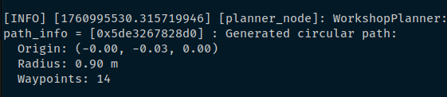
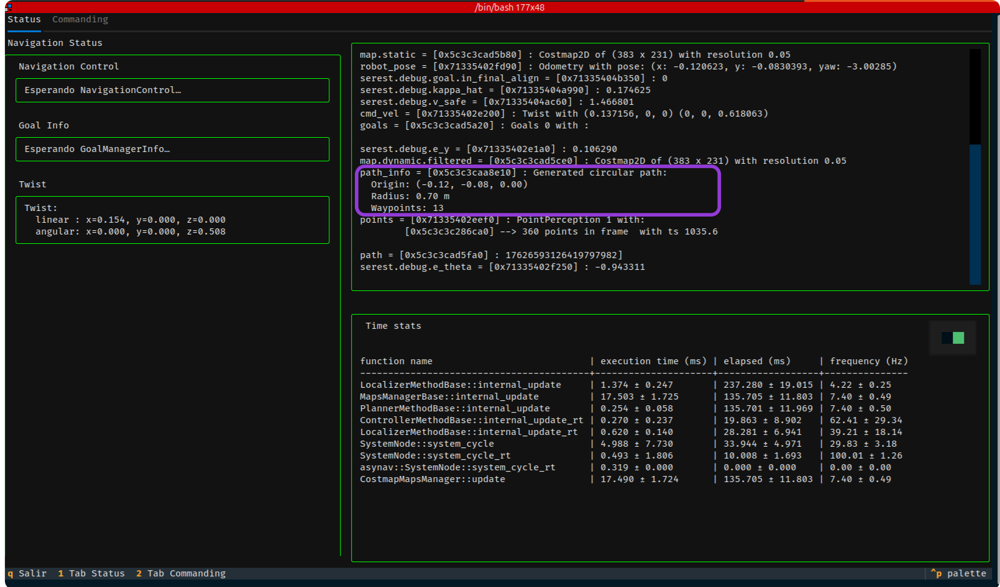
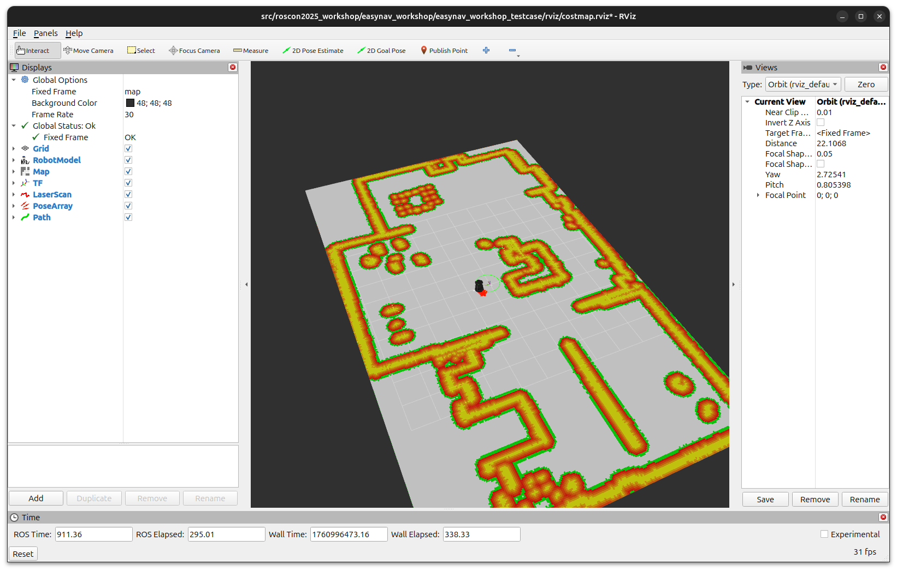

# Exercise 4 - Add Custom NavState

This final exercise introduces one of the core components of the EasyNav architecture: NavState. NavState implements a shared blackboard pattern, enabling all modules, such as localizers, planners, and controllers; to exchange data directly without relying on ROS 2 communication mechanisms internally.

All information used or generated by EasyNav modules passes through NavState. Typical examples include:
- The robot’s estimated pose: `robot_pose`
- A list of navigation goals: `goals`
- The planned path to follow: `path`
- Environment maps: `map`, `map.static`, `map.dynamic`
- Control commands: `cmd_vel`


## Accessing data in NavState
This exercise is focused on accessing data in the blackboard. To check if a value is available:
```cpp
if (nav_state.has("robot_pose")) {
  // do something
}
``

To read a value, use the templated get method:
```cpp
 const auto goals = nav_state.get<nav_msgs::msg::Goals>("goals");
```

To write a value:
```cpp
nav_state.set("cmd_vel", computed_twist);
```

All values are stored under a string key and must be copyable.
You can store standard ROS messages, custom types, or even nested structures.


## Custom type printers
Another interesting aspect of NavState is custom printers, which provide a way to visualize custom types in debug output. In this exercise, we register a printer for our `PathInfo` type:

```cpp
NavState::register_printer<PathInfo>(
  [](const PathInfo &value)
  {
    std::ostringstream oss;
    oss << "Generated circular path:\n"
        << "  Origin: (" << std::fixed << std::setprecision(2)
        << value.origin.x << ", " << value.origin.y << ", " << value.origin.z << ")\n"
        << "  Radius: " << std::fixed << std::setprecision(2) << value.radius << " m\n"
        << "  Waypoints: " << value.num_waypoints;
    return oss.str();
  });
```

This printer is automatically used when logging NavState contents, providing formatted output for debugging and monitoring.

The image below shows the terminal logging info we get from the `easynav_workshop_planner` node:


The same data can be observed from the TUI:


## Exercise

For this exercise, you will work on a plugin designed to generate a circular path based on the robot's current pose, a specified radius, and a defined number of waypoints. Your task is to complete the sections marked with `// TODO` comments. These tasks involve interacting with the NavState blackboard to depict and store data using the following structure:

```cpp
  struct PathInfo
  {
    geometry_msgs::msg::Point origin;
    double radius;
    int num_waypoints;
  };
```

Once completed, test your implementation using the custom parameters file available in this folder: `~/roscon2025_workshop/exercises/easynav/4.add_custom_navstate/custom.params.yaml`.

This ensures the custom plugin is properly loaded and configured. The following execution should result in this visualization.



1. Build the package:
 ```bash
colcon build --packages-select easynav_workshop_planner
```
2. Source the setup file:
```bash
source install/setup.bash
```
3. Launch the Kobuki playground. We can use it without graphic interface:
```bash
ros2 launch easynav_playground_kobuki playground_kobuki.launch.py gui:=false
```

4. Start RViz (use simulation time):
```bash
ros2 run rviz2 rviz2 -d ~/roscon2025_workshop/workshop_ws/src/easynav_playground/easynav_workshop_testcase/rviz/costmap.rviz 
```
5. Start EasyNav with this exercise params:
```bash
ros2 run easynav_system system_main --ros-args --params-file ~/roscon2025_workshop/exercises/easynav/4.add_custom_navstate/custom.params.yaml 
```

Check all information from the path is provided both in the logger of the `easynav_system` terminal and the TUI.