# Exercise 5: Using NavMap representation

Into EasyNav project, there is a world representation where it is possible to navigate. This representation is called NavMap, and it is create to be easy to navigate and to be efficient in terms of memory and computational cost.

## Launch Outdoor Playground

To start this exercise, we will launch the outdoor playground scenario. You can do it by running the following command:

```bash
ros2 launch easynav_playground_summit playground_summit.launch.py 
```

This launch file will start a simulation in Gazebo with a Summit XL robot in an outdoor playground environment.

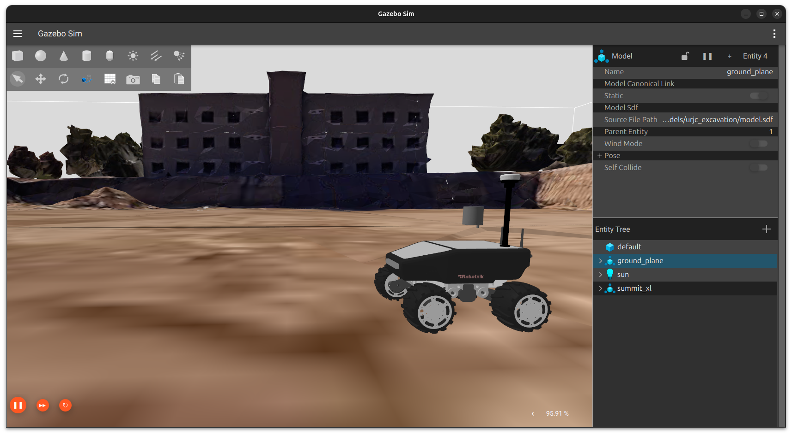

## How to Visualize a NavMap

NavMap is integrated to be used in EasyNav, due to this, there is a Maps Manager for NavMap where you can read from different sources and publish the NavMap to be used by the rest of the system.

In this part, we will to read information from a `*.navmap` file and using NavMap Maps Manager to publish and visualize it using RViz.

Follow the steps:

1. In a package of your workspace, set a `parameters file` where you configure a Maps Manager description (You can use a template called `navmap.params.yaml` located in this folder). The Maps Manager description suggested is shown as follow:

```yaml
maps_manager_node:
  ros__parameters:
    use_sim_time: true
    map_types: [<your type here 1>] # could be more than one (separated by commas)
    <your type here 1>:
      freq: <desired frequency> 
      plugin: <plugin name> # Usually is a plugin_tape/plugin_name 
      package: <pkg where save/load maps>
      <your type here 1>_path_file: maps/<File name>
```

Where `<your type here 1>` is the type of map you want to use, in this case `navmap`. The `<plugin name>` for NavMap is `easynav_navmap_maps_manager/NavMapMapsManager`, and the `<pkg where save/load maps>` we recommend you locate params file in `easynav_workshop_testcase`. The path file is the path to the `*.navmap` file you want to load, you can find maps files in maps folder into `easynav_workshop_testcase` package.

2. Now we can run easynav with this configuration. You can run easynav passing the params file you created as follow:

```bash
ros2 run easynav_system system_main 
  --ros-args --params-file <parameters file path>
```

3. Once the system is running without errors, you can open RViz2 to visualize the NavMap. You need to add a new display of type `NavMapDisplay`:

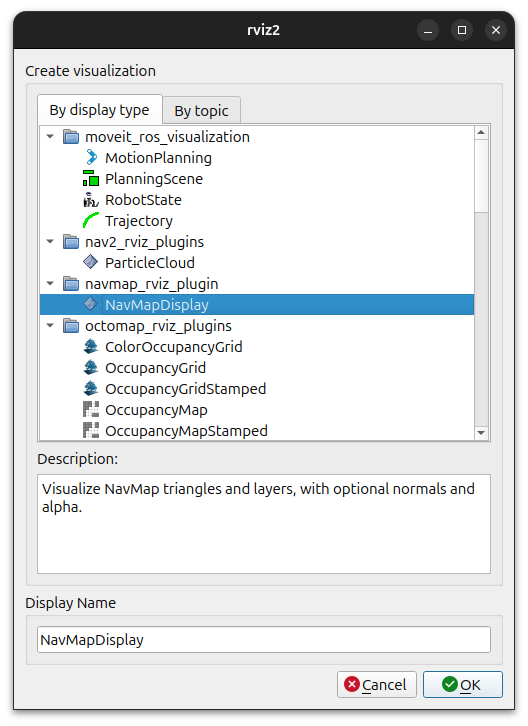

and set the topic to `/maps_manager_node/navmap/map`:

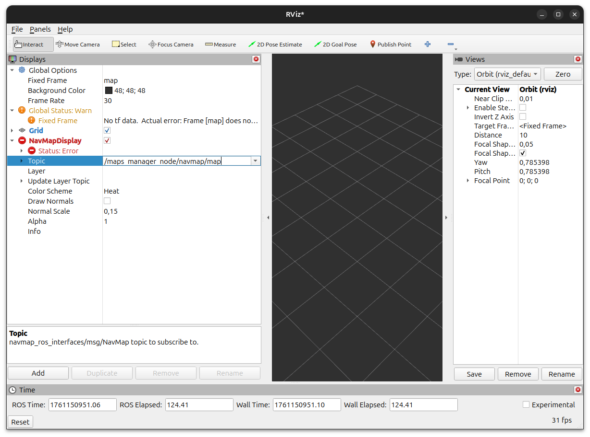

4. Now we should change the durability of the topic to `Transient Local` to be able to visualize the map.

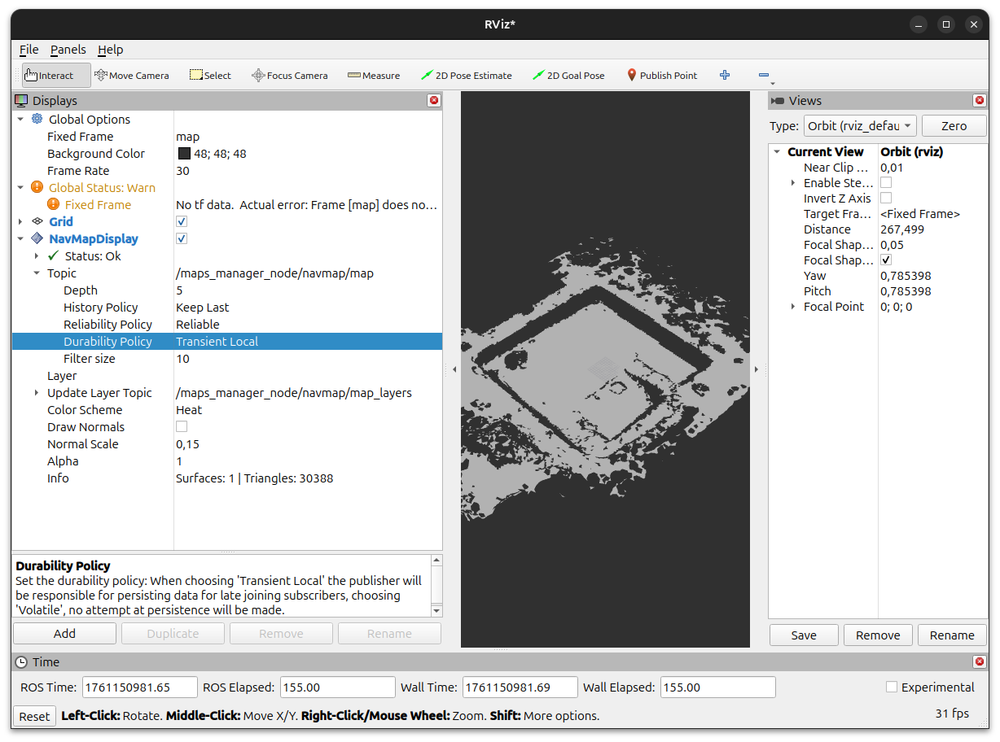

5. We need to set the layer of the NavMapDisplay to visualize it correctly. In this case, we will set it to `elevation`.

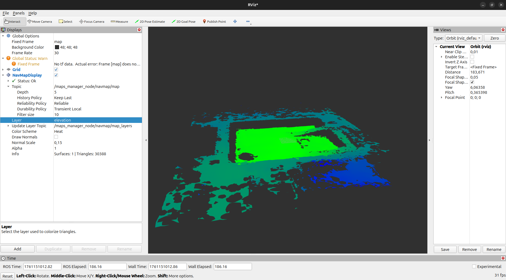

6. Finally, you should be able to visualize the NavMap in RViz2. If you want to visualize normals for each NavCell, you can enable the option `Draw Normals` in the NavMapDisplay.

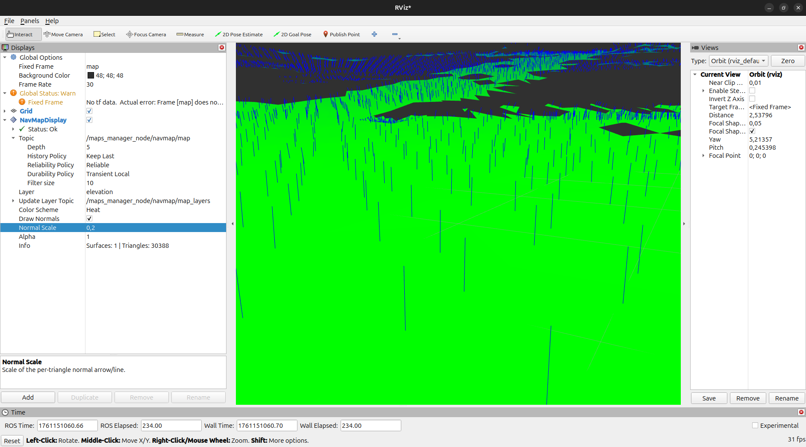

Check that the normals change according to the orientation of the NavCells.

## Localization in NavMap

Now that we have visualized the NavMap, we can use it for localization. We have developed a Localizer using NavMap representation. 

1. To use it, you need to set the Localizer type to `Localizer` in the parameters file used to launch EasyNav system. The Localizer description suggested is shown as follow:

```yaml
localizer_node:
  ros__parameters:
    use_sim_time: true
    localizer_types: [dummy]
    dummy:
      rt_freq: 50.0
      freq: 5.0
      reseed_freq: 0.1
      plugin: easynav_navmap_localizer/AMCLLocalizer
      num_particles: 100
      noise_translation: 0.1
      noise_rotation: 0.03
      noise_translation_to_rotation: 0.02
      min_noise_xy: 0.2
      min_noise_yaw: 0.1
      compute_odom_from_tf: true 
      initial_pose:
        x: 0.0
        y: 0.0
        yaw: 0.0
        std_dev_xy: 0.05
        std_dev_yaw: 0.01
```

Where the plugin used is `easynav_navmap_localizer/AMCLLocalizer`, which is an Adaptive Monte Carlo Localization (AMCL) implementation for NavMap representation.

2. Once you have set the Localizer description in the parameters file, you can launch EasyNav system again with the same command as before. The Localizer will use the NavMap published by the Maps Manager to localize the robot. We can visualize the estimated pose of the robot in RViz2 by adding a `PoseArray` display and setting the topic to `/localizer_node/dummy/particles`.

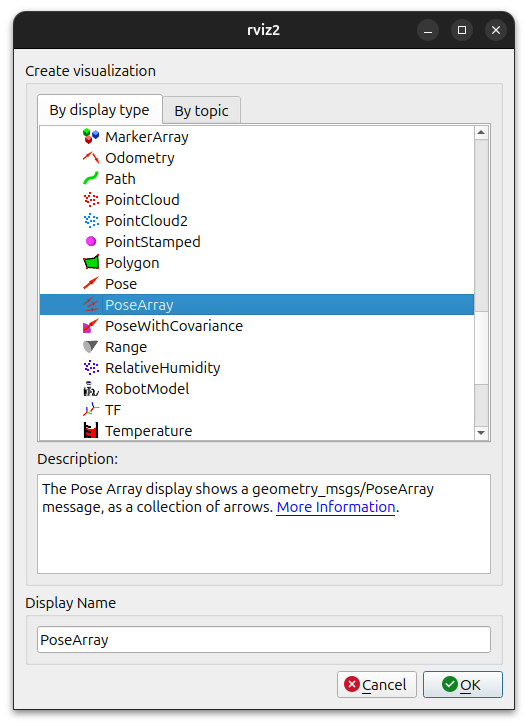

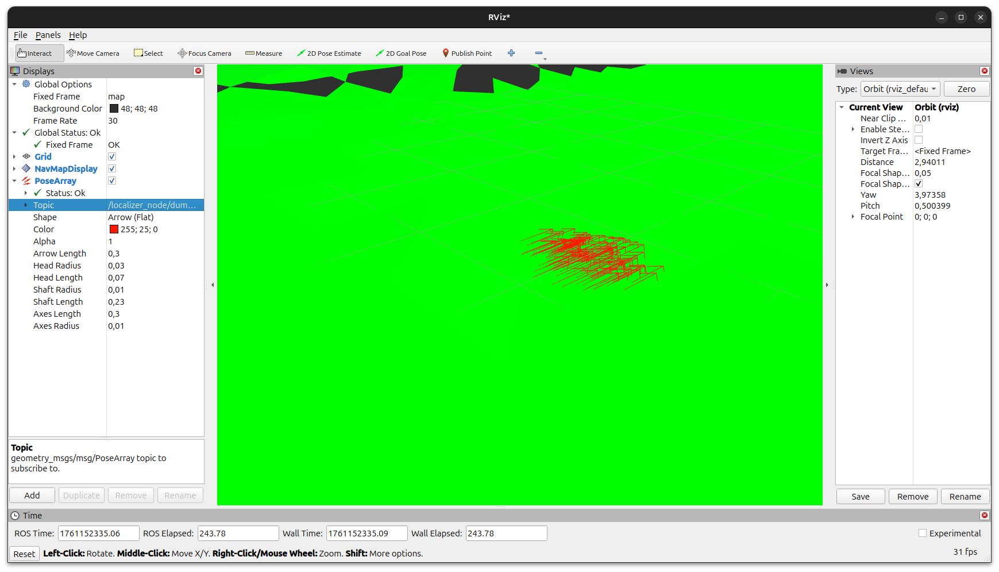

You should see the particles representing the estimated poses of the robot according to the NavMap.

3. We can also visualize the TF tree generated by `robot_description`, we add a TF display in RViz2.

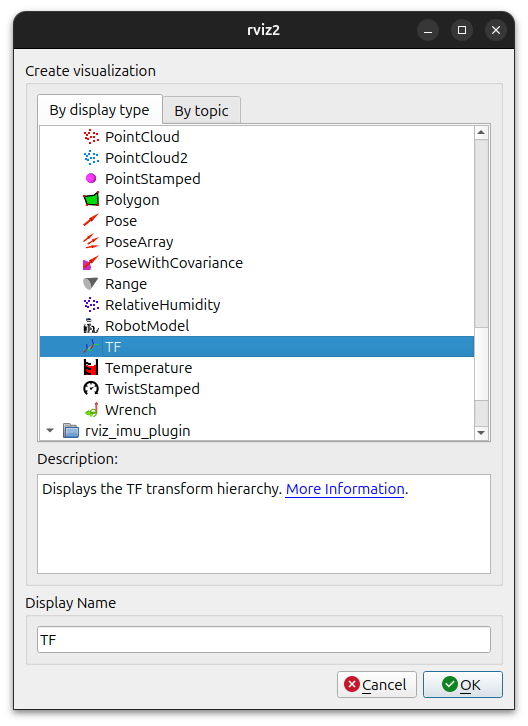

If the topic was set correctly, you should see the TF tree as shown below:

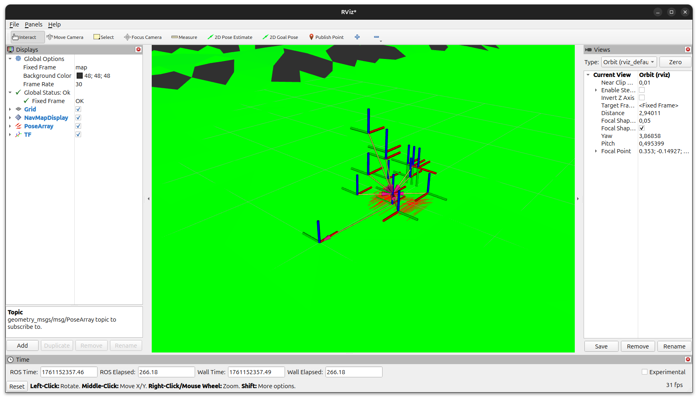

4. It we can visualize the robot model in RViz2, we can add a `RobotModel` display and set the topic to `robot_description`. If everything is set correctly, you should see the robot model in RViz2 as shown below:

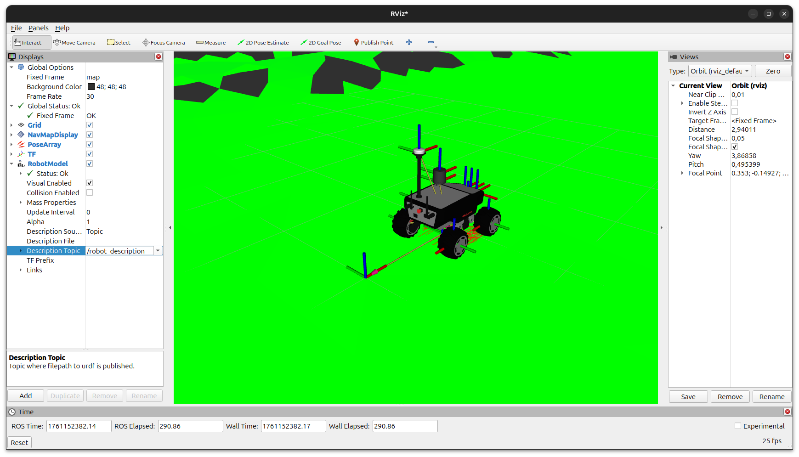

5. To teleoperate the robot in the simulation, you can use the `teleop_twist_keyboard` package. Open a new terminal and run the following command:

```bash
ros2 run teleop_twist_keyboard teleop_twist_keyboard
```

This will allow you to control the robot using the keyboard. Where you can use the following keys to move the robot:  

```txt
   u    i    o
   j    k    l
   m    ,    .
```

Being `i` to move forward, `,` to backward, `j` and `l` to turn left and right respectively, and the other keys for diagonal movements.

Now you can localize using NavMap representation while teleoperating the robot in the simulation as is shown in the following image:

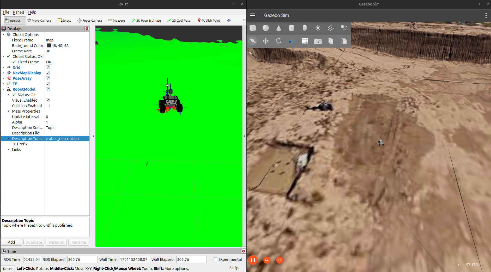

## How to Visualize a Bonxai

[Bonxai](https://github.com/facontidavide/Bonxai) is another world representation integrated into EasyNav. It is a 3D voxel-based representation that allows to represent complex environments efficiently.

To visualize a Bonxai map, you can follow similar steps as for NavMap, but using the Bonxai Maps Manager and Bonxai Display in RViz2.

1. In a package of your workspace, set a `parameters file` where you configure a Maps Manager description for Bonxai (You can add another map type to the previous params file). Add the following description to the params file used before Where `<your type here 2>` is the type of map you want to use, in this case `bonxai`. The `<plugin name>` for NavMap is `easynav_bonxai_maps_manager/BonxaiMapsManager`, and the `<pkg where save/load maps>` we recommend you locate params file in `easynav_workshop_testcase`. The path file is the path to the `*.pcd` file you want to load, you can find maps files in maps folder into `easynav_workshop_testcase` package.

2. Now we can run easynav with this configuration. You can run easynav passing the params file you created as follow:

```bash
ros2 run easynav_system system_main 
  --ros-args --params-file <parameters file path>
```

3. Once the system is running without errors, you can open RViz2 to visualize the Bonxai map. You need to add a new display from available topics as it is shown.

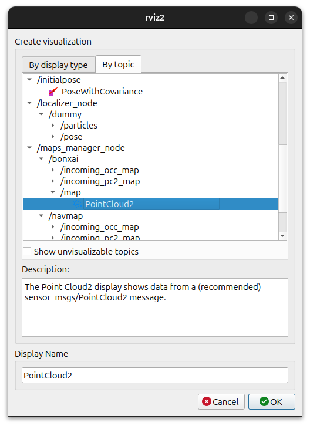

4. Now we should change the durability of the topic to `Transient Local` to be able to visualize the map.

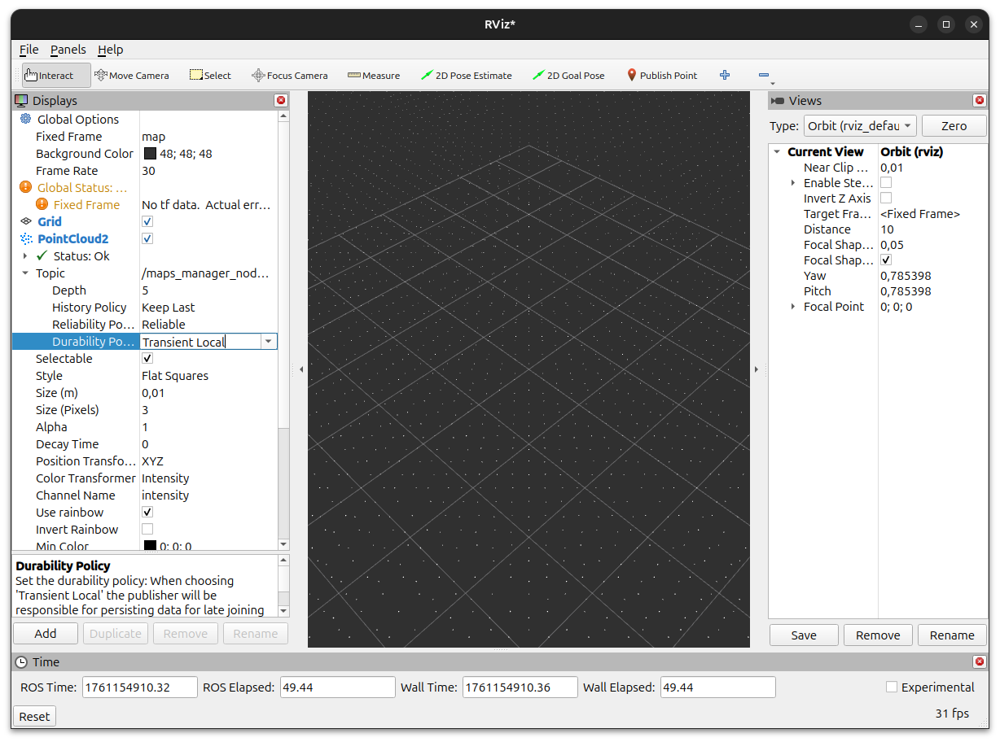

5. We can change the style mode of the Bonxai Display to visualize it correctly. In this case, we will set it to `Boxes`. Alternatively, you can set `size` to increase their volume in visualization.

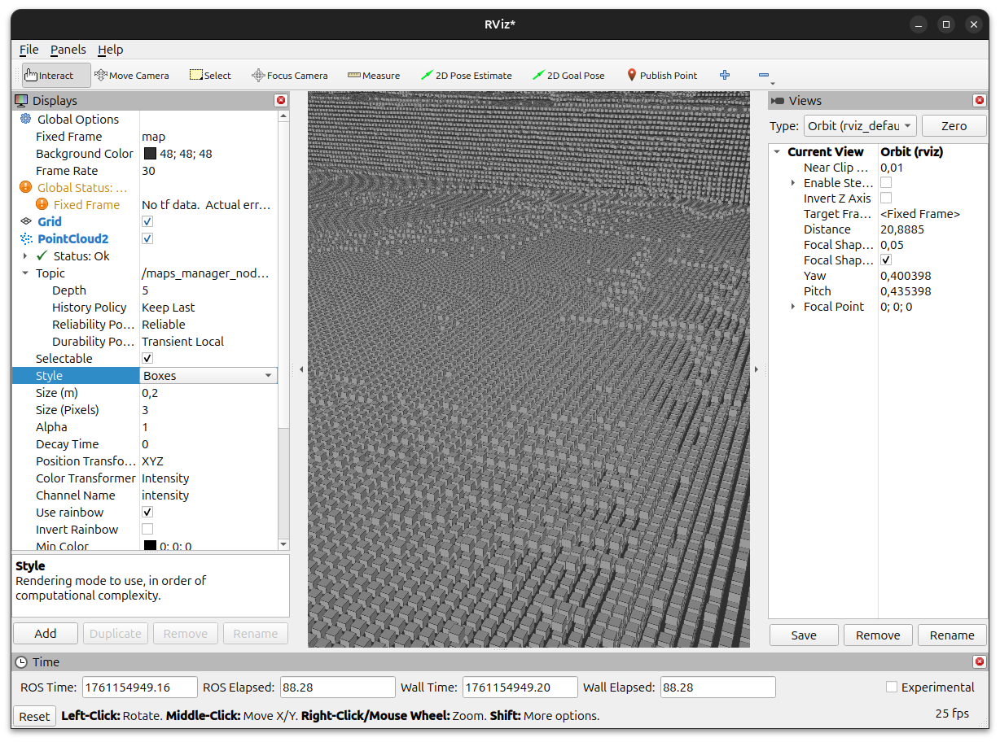

6. Another option higlhy recommended is to use `Axis Color` in Color Transformer to visualize the Bonxai map with a color gradient according to the height of each voxel.

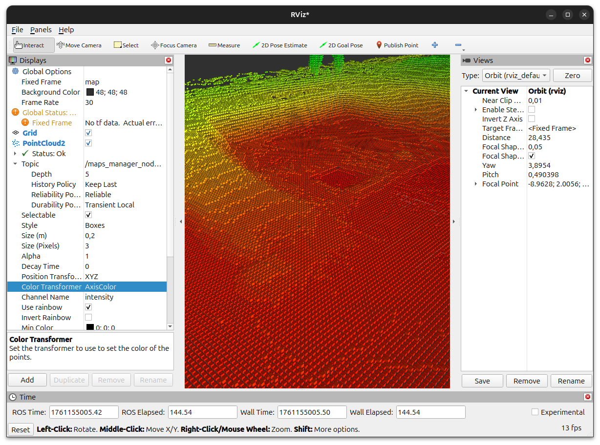

7. Finally, you should be able to visualize the Bonxai map and NavMap together in RViz2 as shown below:

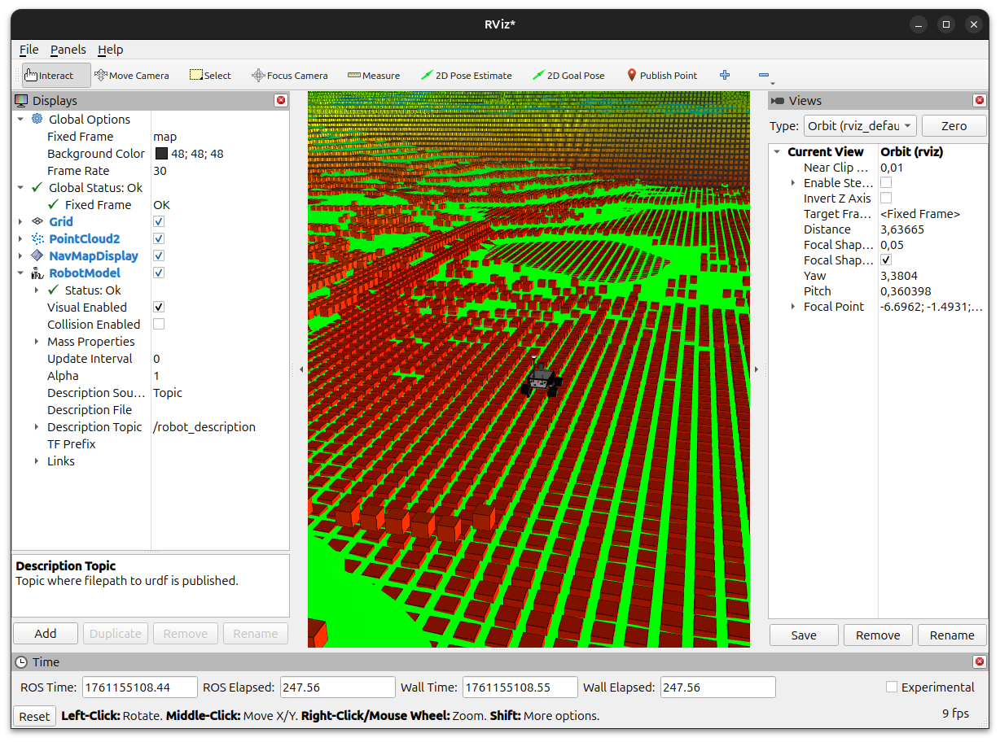

## Conclusion

In this exercise, we have learned how to use NavMap representation in EasyNav for localization. We have also seen how to visualize Bonxai representation in RViz2. Both representations provide efficient ways to represent and navigate complex environments in robotics applications and they integrate into EasyNav.