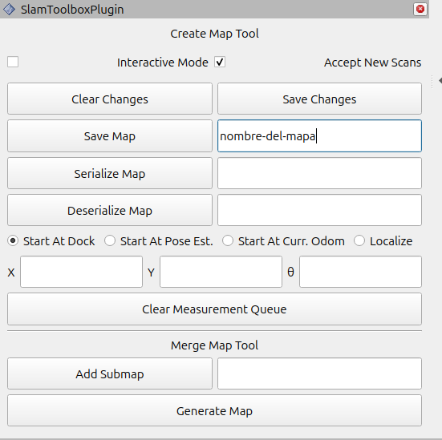

## Generating a map using slam_toolbox

1. Launch the simulation environment with Kobuki:
```bash
ros2 launch easynav_playground_kobuki playground_kobuki.launch.py lidar_range:=30.0
```

2. In another terminal, launch slam_toolbox to generate the map:
```bash
ros2 launch nav2_playground slam_launch.py
```

3. Use RViz to visualize the map being built and teleoperation to move the robot:
```bash
ros2 run teleop_twist_keyboard teleop_twist_keyboard
```

4. Once mapping is complete, save the map:

> **Note:** In both methods (service and GUI) only the map name is required, not the full path. The map will be saved in the directory from where you launched the service (method 4a) or the launch file (method 4b).

**4a. Via service:**
```bash
ros2 service call /slam_toolbox/save_map slam_toolbox/srv/SaveMap "name:
  data: 'map-name'"
```

**4b. Via GUI in RViz:**

Use the slam_toolbox panel in RViz to save the map:




