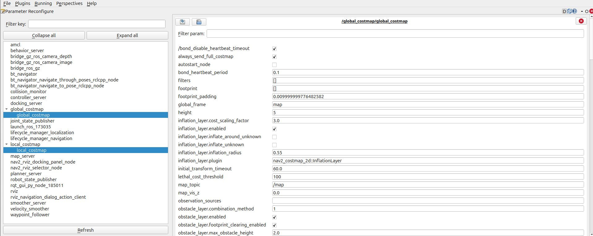
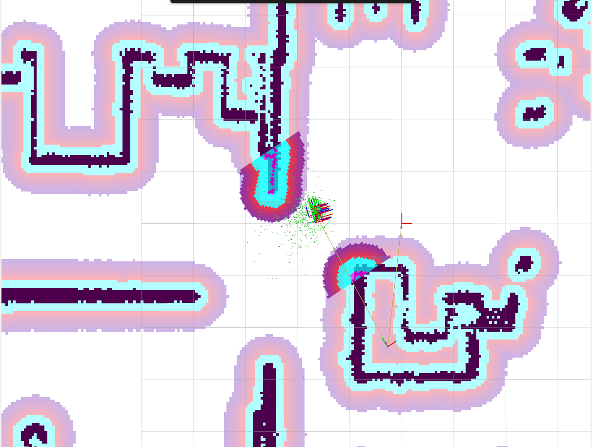
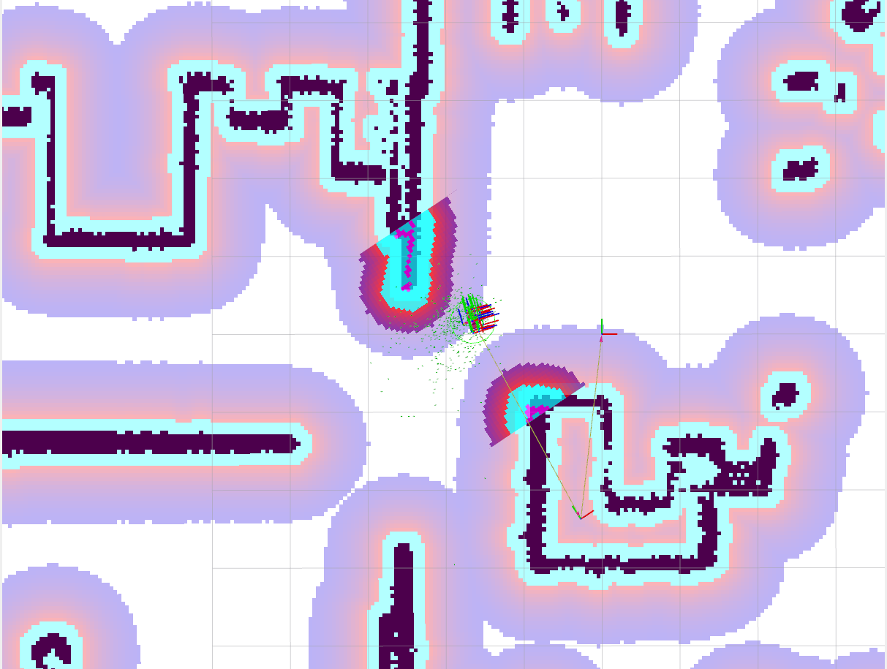
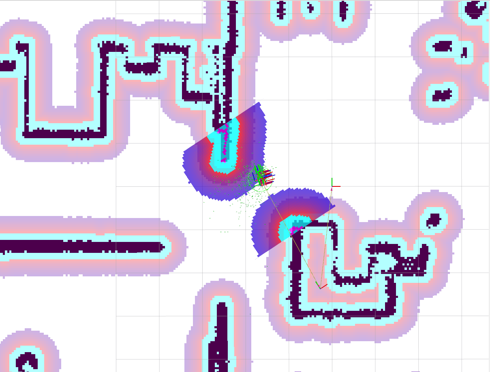

## Parameter Configuration

> **Note:** In this workshop we will use `rqt_reconfigure` to modify parameters. In a production environment, it is recommended to modify parameters directly in the Nav2 YAML configuration file.

1. Launch the simulation environment with Kobuki:
```bash
ros2 launch easynav_playground_kobuki playground_kobuki.launch.py
```

2. In another terminal, launch the navigation stack with the generated map:
```bash
ros2 launch nav2_playground navigation_launch.py map:=<path-to-generated-yaml>
```

3. With the navigation stack running, open rqt:
```bash
rqt
```

4. In rqt, go to `Plugins` → `Configuration` → `Dynamic Reconfigure`

<p align="center">
  
</p>

5. Explore and modify parameters of different Nav2 plugins, such as modifying the inflation radius of the `local_costmap` and `global_costmap`:

<p align="center">
  
  
  
</p>
<p align="center">
  <em>Before → Global Costmap (after) → Local Costmap (after)</em>
</p>

6. Modify the costmap layers by editing the `nav2_kobuki_params.yaml` file:

   **For the Global Costmap:**
   - Remove the `obstacle_layer` layer
   
   **For the Local Costmap:**
   - Remove the `voxel_layer` layer
   - Add the `obstacle_layer` layer in its place
   
   After modifying the file, relaunch the navigation stack to apply the changes.
