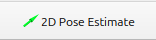

## Navigation

1. Launch the navigation stack with the generated map:
```bash
ros2 launch nav2_playground navigation_launch.py map:=<path-to-generated-yaml>
```

For example:
```bash
ros2 launch nav2_playground navigation_launch.py map:=/home/user/my_map.yaml
```

2. In RViz, use the "2D Pose Estimate" tool to set the robot's initial pose.

<p align="center">
  
  
</p>

3. Use the "Nav2 Goal" tool to send navigation goals to the robot.

<p align="center">
  
  
</p>