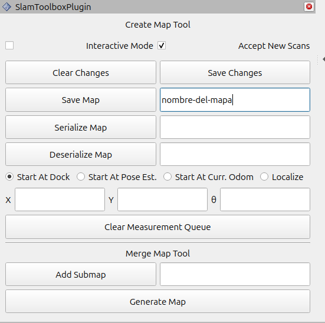
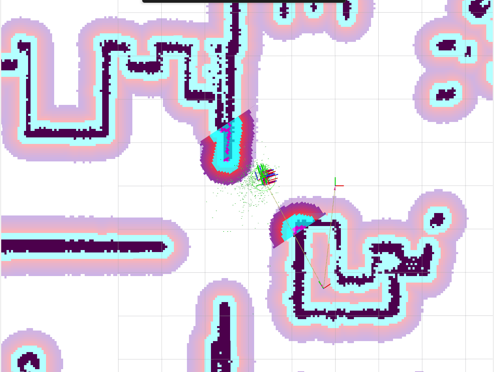
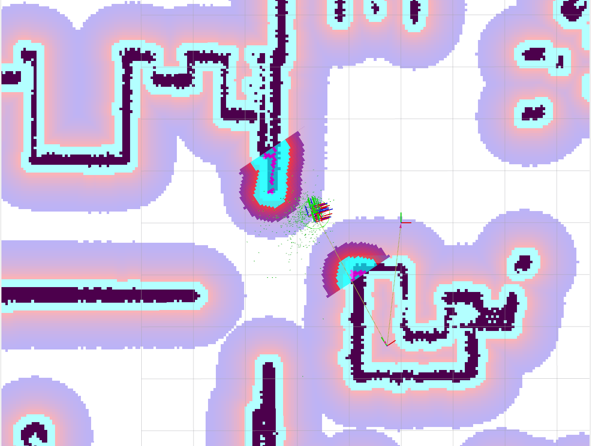
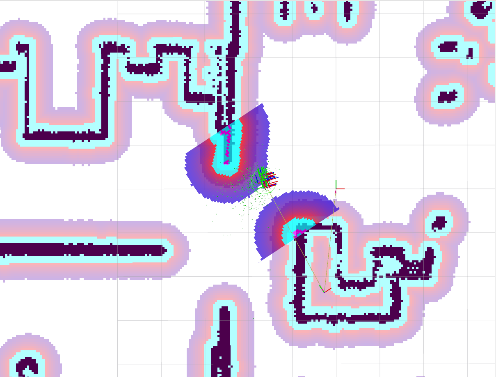

# Nav2 Playground - Kobuki

## Description

This repository is designed for the first part of the navigation workshop using Nav2. It provides practical examples that guide through the complete autonomous navigation pipeline:

1. **Map generation**: Creating maps using SLAM
2. **Navigation**: Configuration and tuning of Nav2 parameters
3. **Practical application**: Implementation of a patrolling system

**Workshop slides:** [https://docs.google.com/presentation/d/1EolsYLnZf61nYQTu813rE4UZZ7SsVHEgQi_jr4Pu7Vo/edit?usp=sharing](https://docs.google.com/presentation/d/1EolsYLnZf61nYQTu813rE4UZZ7SsVHEgQi_jr4Pu7Vo/edit?usp=sharing)

## Installation

### Prerequisites
- ROS 2 (Jazzy/Kilted)
- Colcon

### Installation Steps

1. Clone the repository into your workspace:
```bash
cd <your-workspace>/src/
git clone https://github.com/EasyNavigation/easynav_playground_kobuki.git
```

2. Import dependencies:
```bash
cd <your-workspace>/src/
vcs import . < easynav_playground_kobuki/thirdparty.repos
```

3. Install dependencies with rosdep:
```bash
cd <your-workspace>
rosdep install --from-paths src --ignore-src -r -y
```

4. Build the workspace:
```bash
colcon build --symlink-install
```

5. Source the workspace:
```bash
source install/setup.bash
```

## Generating a map using slam_toolbox

1. Launch the simulation environment with Kobuki:
```bash
ros2 launch nav2_playground playground_kobuki.launch.py
```

2. In another terminal, launch slam_toolbox to generate the map:
```bash
ros2 launch nav2_playground slam_launch.py
```

3. Use RViz to visualize the map being built and teleoperation to move the robot:
```bash
ros2 run teleop_twist_keyboard teleop_twist_keyboard
```

4. Once mapping is complete, save the map:

> **Note:** In both methods (service and GUI) only the map name is required, not the full path. The map will be saved in the directory from where you launched the service (method 4a) or the launch file (method 4b).

**4a. Via service:**
```bash
ros2 service call /slam_toolbox/save_map slam_toolbox/srv/SaveMap "name:
  data: 'map-name'"
```

**4b. Via GUI in RViz:**

Use the slam_toolbox panel in RViz to save the map:



## Navigation

1. Launch the navigation stack with the generated map:
```bash
ros2 launch nav2_playground navigation_launch.py map:=<path-to-generated-yaml>
```

For example:
```bash
ros2 launch nav2_playground navigation_launch.py map:=/home/user/my_map.yaml
```

2. In RViz, use the "2D Pose Estimate" tool to set the robot's initial pose.

<p align="center">
  
  
</p>

3. Use the "Nav2 Goal" tool to send navigation goals to the robot.

<p align="center">
  
  
</p>

## Parameter Configuration

> **Note:** In this workshop we will use `rqt_reconfigure` to modify parameters. In a production environment, it is recommended to modify parameters directly in the Nav2 YAML configuration file.

1. With the navigation stack running, open rqt:
```bash
rqt
```

2. In rqt, go to `Plugins` → `Configuration` → `Dynamic Reconfigure`

<p align="center">
  
</p>

3. Explore and modify parameters of different Nav2 plugins, such as modifying the inflation radius of the `local_costmap` and `global_costmap`:

<p align="center">
  
  
  
</p>
<p align="center">
  <em>Before → Global Costmap (after) → Local Costmap (after)</em>
</p>

4. Modify the costmap layers by editing the `nav2_kobuki_params.yaml` file:

   **For the Global Costmap:**
   - Remove the `obstacle_layer` layer
   
   **For the Local Costmap:**
   - Remove the `voxel_layer` layer
   - Add the `obstacle_layer` layer in its place
   
   After modifying the file, relaunch the navigation stack to apply the changes.

## Patrolling

### Using the NavigateToPose action

1. Launch the simulation (if not already running):
```bash
ros2 launch nav2_playground playground_kobuki.launch.py
```

2. Launch the navigation stack:
```bash
ros2 launch nav2_playground navigation_launch.py map:=<path-to-generated-yaml>
```

3. Launch the patrolling node with NavigateToPose:

**Using Python:**
```bash
ros2 launch nav2_playground patrol_launch.py use_cpp:=false use_poses:=false
```

**Using C++:**
```bash
ros2 launch nav2_playground patrol_launch.py use_cpp:=true use_poses:=false
```

### Using the NavigateThroughPoses action

1. Launch the simulation (if not already running):
```bash
ros2 launch nav2_playground playground_kobuki.launch.py
```

2. Launch the navigation stack:
```bash
ros2 launch nav2_playground navigation_launch.py map:=<path-to-generated-yaml>
```

3. Launch the patrolling node with NavigateThroughPoses:

**Using Python:**
```bash
ros2 launch nav2_playground patrol_launch.py use_cpp:=false use_poses:=true
```

**Using C++:**
```bash
ros2 launch nav2_playground patrol_launch.py use_cpp:=true use_poses:=true
```
